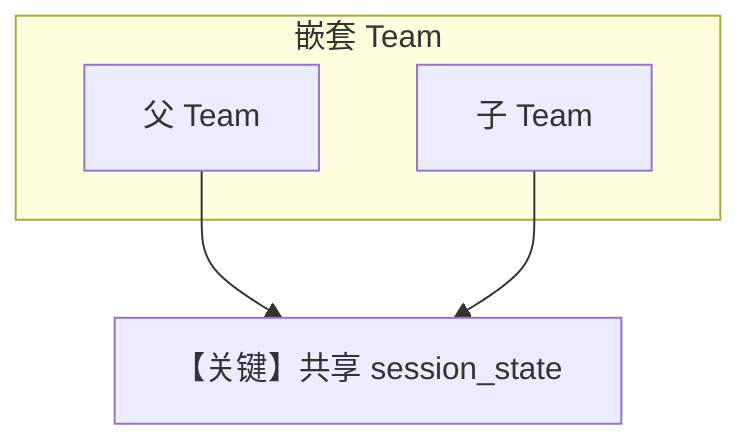

# nested_shared_state.py — 实现原理分析

> 源文件：`cookbook/03_teams/21_state/nested_shared_state.py`

## 概述

本示例展示 **嵌套 Team + 共享 `session_state`**：子 Team 与父 Team 通过同一 `RunContext.session_state` 协调；自定义工具 `add_item`/`remove_item` 直接 **原地修改** `run_context.session_state["shopping_list"]`。

## 运行机制与因果链

层次结构下状态合并/可见性由框架传播；工具函数见 `.py` L20-50。

## Mermaid 流程图

```mermaid
flowchart TD
    subgraph NS["嵌套 Team"]
        P["父 Team"]
        C["子 Team"]
    end
    P --> SS["【关键】共享 session_state"]
    C --> SS
```

## 关键源码文件索引

| 文件 | 作用 |
|------|------|
| `agno/run/__init__.py` | `RunContext.session_state` |
