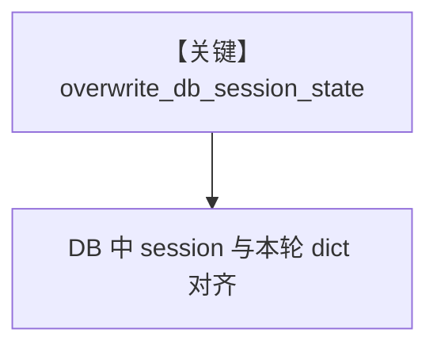

# overwrite_stored_session_state.py — 实现原理分析

<!-- cookbook-py-source:start -->
## 完整源码

```python
"""
Overwrite Stored Session State
==============================

Demonstrates replacing persisted session_state with run-time session_state.
"""

from agno.db.sqlite import SqliteDb
from agno.models.openai import OpenAIResponses
from agno.team import Team

# ---------------------------------------------------------------------------
# Create Team
# ---------------------------------------------------------------------------
team = Team(
    model=OpenAIResponses(id="gpt-5.2"),
    db=SqliteDb(db_file="tmp/agents.db"),
    members=[],
    markdown=True,
    session_state={},
    add_session_state_to_context=True,
    overwrite_db_session_state=True,
)

# ---------------------------------------------------------------------------
# Run Team
# ---------------------------------------------------------------------------
if __name__ == "__main__":
    team.print_response(
        "Can you tell me what's in your session_state?",
        session_state={"shopping_list": ["Potatoes"]},
        stream=True,
    )
    print(f"Stored session state: {team.get_session_state()}")

    team.print_response(
        "Can you tell me what is in your session_state?",
        session_state={"secret_number": 43},
        stream=True,
    )
    print(f"Stored session state: {team.get_session_state()}")
```

<!-- cookbook-py-source:end -->

> 源文件：`cookbook/03_teams/21_state/overwrite_stored_session_state.py`

## 概述

本示例展示 **`overwrite_db_session_state=True`**：当本次 run 提供 `session_state` 时，**用内存 dict 覆盖** 数据库中已持久化的会话状态，避免旧键残留。

**核心配置一览：**

| 配置项 | 值 |
|--------|-----|
| `overwrite_db_session_state` | `True` |
| `add_session_state_to_context` | `True` |
| `session_state` | 初始 `{}` |

## 运行机制与因果链

第一次 run 传 `shopping_list`，第二次传 `secret_number`，验证覆盖语义（见 `.py` 打印）。

## Mermaid 流程图



## 关键源码文件索引

| 文件 | 作用 |
|------|------|
| `agno/team/_run.py` | session_state 合并策略 |
