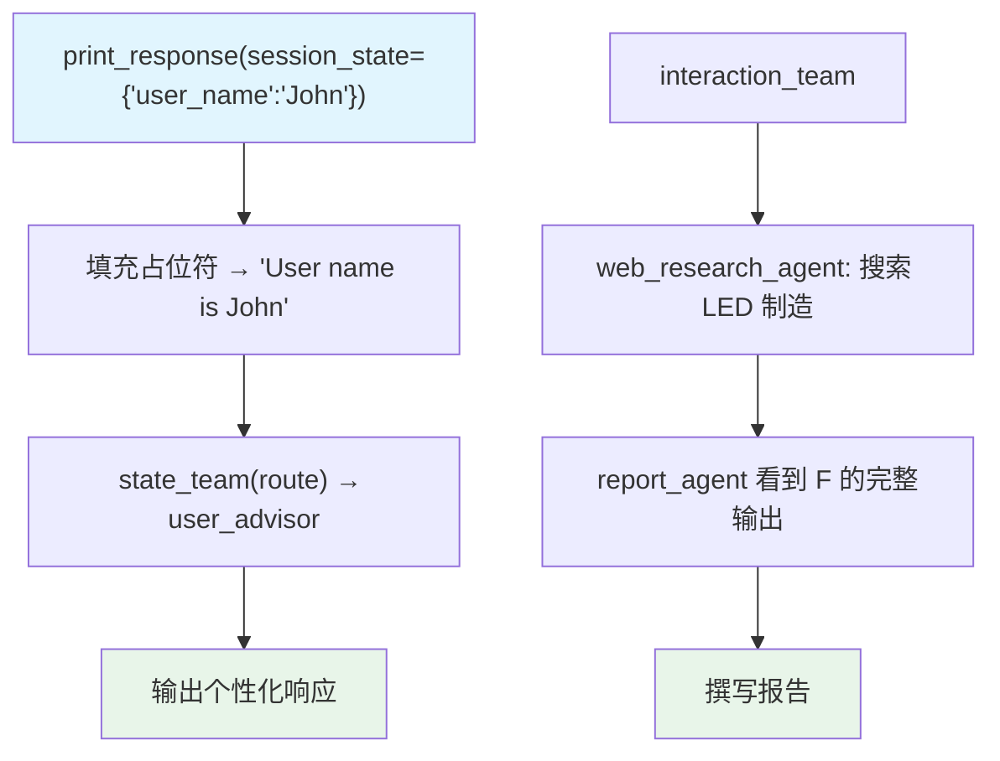

# state_sharing.py — 实现原理分析

> 源文件：`cookbook/03_teams/21_state/state_sharing.py`

## 概述

本示例展示两种状态共享机制：1）**`session_state` + `add_session_state_to_context=True`**——将 `session_state` 字典（如 `{"user_name": "John", "age": 30}`）注入成员 Agent 指令的 `{placeholder}` 中，实现个性化；2）**`share_member_interactions=True`**——在当前 run 中，后续成员能看到前序成员的对话记录，实现上下文共享。

**核心配置一览：**

| 配置项 | 值 | 说明 |
|--------|------|------|
| `session_state` | `{"user_name": "John", "age": 30}` | run 时传入的状态 |
| `add_session_state_to_context` | `True` | 注入成员指令占位符 |
| `share_member_interactions` | `True` | 成员间共享当前 run 的交互 |

## 核心组件解析

### `session_state` + 占位符

```python
user_advisor = Agent(
    instructions="User's name is {user_name} and age is {age}",  # 占位符
)

state_team.print_response(
    "Write a short poem about my name and age",
    session_id="session_1",
    session_state={"user_name": "John", "age": 30},
    add_session_state_to_context=True,  # 填充占位符
)
```

第二轮不传 `session_state`，但 `session_id` 相同，状态从 `InMemoryDb` 中读取，`add_session_state_to_context=True` 仍然有效。

### `share_member_interactions=True`

```python
interaction_team = Team(
    members=[web_research_agent, report_agent],
    share_member_interactions=True,  # 关键：后续成员看到前序成员的对话
)
```

`report_agent` 在当前 run 中能看到 `web_research_agent` 的完整响应，无需 Leader 转述。

## Mermaid 流程图



## 关键源码文件索引

| 文件 | 关键函数/类 | 作用 |
|------|------------|------|
| `agno/team/team.py` | `session_state`, `add_session_state_to_context`, `share_member_interactions` | 状态共享配置 |
