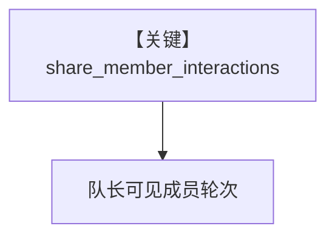

# state_sharing.py — 实现原理分析

<!-- cookbook-py-source:start -->
## 完整源码

```python
"""
State Sharing
=============================

Demonstrates sharing session state and member interactions across team members.
"""

from agno.agent import Agent
from agno.db.in_memory import InMemoryDb
from agno.db.sqlite import SqliteDb
from agno.models.openai import OpenAIResponses
from agno.team import Team, TeamMode
from agno.tools.websearch import WebSearchTools

# ---------------------------------------------------------------------------
# Create Members
# ---------------------------------------------------------------------------
user_advisor = Agent(
    role="User Advisor",
    description="You answer questions related to the user.",
    model=OpenAIResponses(id="gpt-5.2"),
    instructions="User's name is {user_name} and age is {age}",
)

web_research_agent = Agent(
    name="Web Research Agent",
    model=OpenAIResponses(id="gpt-5-mini"),
    tools=[WebSearchTools()],
    instructions="You are a web research agent that can answer questions from the web.",
)

report_agent = Agent(
    name="Report Agent",
    model=OpenAIResponses(id="gpt-5-mini"),
    instructions="You are a report agent that can write a report from the web research.",
)

# ---------------------------------------------------------------------------
# Create Team
# ---------------------------------------------------------------------------
state_team = Team(
    db=InMemoryDb(),
    model=OpenAIResponses(id="gpt-5.2"),
    instructions="You are a team that answers questions related to the user. Delegate to the member agent to address user requests or answer any questions about the user.",
    members=[user_advisor],
    mode=TeamMode.route,
)

interaction_team = Team(
    model=OpenAIResponses(id="gpt-5-mini"),
    db=SqliteDb(db_file="tmp/agents.db"),
    members=[web_research_agent, report_agent],
    share_member_interactions=True,
    instructions=[
        "You are a team of agents that can research the web and write a report.",
        "First, research the web for information about the topic.",
        "Then, use your report agent to write a report from the web research.",
    ],
    show_members_responses=True,
    debug_mode=True,
)

# ---------------------------------------------------------------------------
# Run Team
# ---------------------------------------------------------------------------
if __name__ == "__main__":
    state_team.print_response(
        "Write a short poem about my name and age",
        session_id="session_1",
        user_id="user_1",
        session_state={"user_name": "John", "age": 30},
        add_session_state_to_context=True,
    )

    state_team.print_response(
        "How old am I?",
        session_id="session_1",
        user_id="user_1",
        add_session_state_to_context=True,
    )

    interaction_team.print_response("How are LEDs made?")
```

<!-- cookbook-py-source:end -->

> 源文件：`cookbook/03_teams/21_state/state_sharing.py`

## 概述

本示例展示两例：**(1) `TeamMode.route` + `InMemoryDb` + 成员指令含 `{user_name}` 占位；(2) `share_member_interactions=True`** 让成员间可见彼此交互，配合 `SqliteDb` 持久化。

**核心配置一览：**

| 变量 | 要点 |
|------|------|
| `state_team` | `mode=TeamMode.route`，`members=[user_advisor]`，`instructions` 含占位符 |
| `interaction_team` | `share_member_interactions=True`，web research + report |

## 运行机制与因果链

`share_member_interactions` 将成员对话暴露给队长/其他成员上下文（实现见 `agno/team`）；与纯 session_state 不同，侧重 **交互可见性**。

## Mermaid 流程图


```mermaid
flowchart TD
    SI["【关键】share_member_interactions"] --> M["队长可见成员轮次"]
```

## 关键源码文件索引

| 文件 | 作用 |
|------|------|
| `agno/team/team.py` | `share_member_interactions` |
