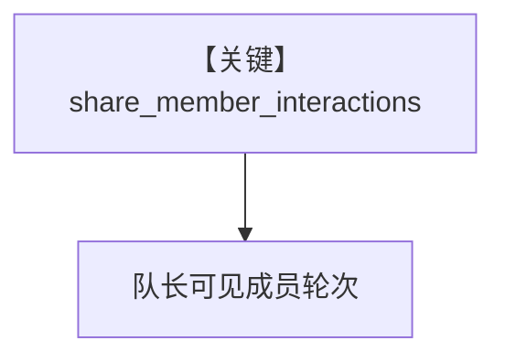

# state_sharing.py — 实现原理分析

> 源文件：`cookbook/03_teams/21_state/state_sharing.py`

## 概述

本示例展示两例：**(1) `TeamMode.route` + `InMemoryDb` + 成员指令含 `{user_name}` 占位；(2) `share_member_interactions=True`** 让成员间可见彼此交互，配合 `SqliteDb` 持久化。

**核心配置一览：**

| 变量 | 要点 |
|------|------|
| `state_team` | `mode=TeamMode.route`，`members=[user_advisor]`，`instructions` 含占位符 |
| `interaction_team` | `share_member_interactions=True`，web research + report |

## 运行机制与因果链

`share_member_interactions` 将成员对话暴露给队长/其他成员上下文（实现见 `agno/team`）；与纯 session_state 不同，侧重 **交互可见性**。

## Mermaid 流程图

```mermaid
flowchart TD
    SI["【关键】share_member_interactions"] --> M["队长可见成员轮次"]
```

## 关键源码文件索引

| 文件 | 作用 |
|------|------|
| `agno/team/team.py` | `share_member_interactions` |
