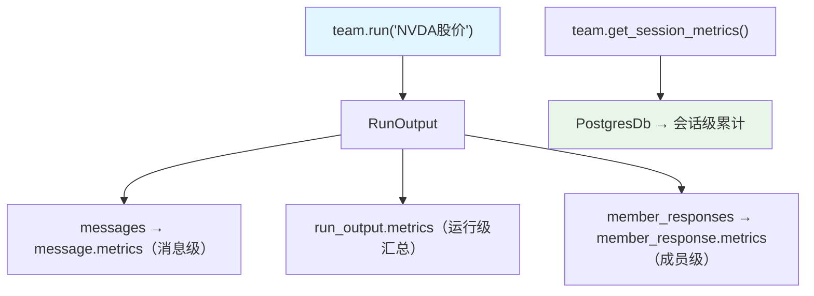

# 01_team_metrics.py — 实现原理分析

> 源文件：`cookbook/03_teams/22_metrics/01_team_metrics.py`

## 概述

本示例展示 **Team 执行指标的完整获取方式**：包括 Leader 消息级指标（每条 assistant 消息的 token 用量）、运行级汇总指标（`run_output.metrics`）、会话级累计指标（`team.get_session_metrics()`）和成员级指标（`run_output.member_responses`）。

**核心配置一览：**

| 指标层级 | 获取方式 | 说明 |
|---------|---------|------|
| 消息级 | `message.metrics` | 每条 assistant 消息 |
| 运行级（Team） | `run_output.metrics` | 本次 run 汇总 |
| 会话级 | `team.get_session_metrics()` | 跨 run 累计 |
| 成员级 | `run_output.member_responses[i].metrics` | 各成员独立 |

## 核心组件解析

### 四层指标读取

```python
# 1. 消息级（Leader 每条 assistant 消息）
for message in run_output.messages:
    if message.role == "assistant":
        pprint(message.metrics)  # input_tokens, output_tokens, time...

# 2. 运行级汇总
pprint(run_output.metrics)

# 3. 会话级累计（跨多次 run）
pprint(team.get_session_metrics(session_id="team_metrics_demo"))

# 4. 成员级
for member_response in run_output.member_responses:
    for message in member_response.messages:
        if message.role == "assistant":
            pprint(message.metrics)
```

### `store_member_responses=True` 的必要性

```python
team = Team(
    store_member_responses=True,  # 持久化成员响应（含消息和指标）
)
```

不设此项时，`run_output.member_responses` 可能为空。

### PostgreSQL 用于会话指标

```python
db = PostgresDb(db_url=db_url, session_table="team_metrics_sessions")
```

会话指标跨 run 累计，需要持久化存储。

## Mermaid 流程图



## 关键源码文件索引

| 文件 | 关键函数/类 | 作用 |
|------|------------|------|
| `agno/team/team.py` | `get_session_metrics()`, `store_member_responses` | 指标获取 |
| `agno/run/base.py` | `RunMetrics` | 指标数据结构 |
