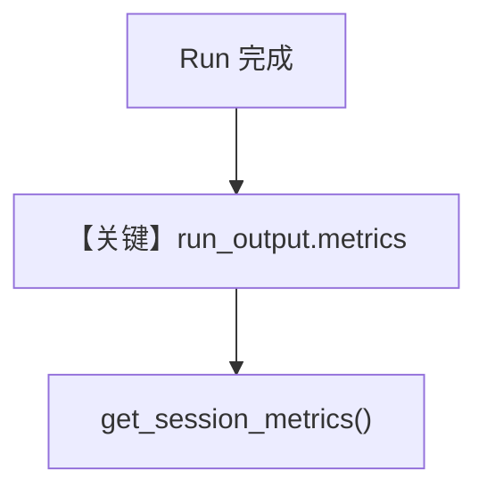

# 01_team_metrics.py — 实现原理分析

<!-- cookbook-py-source:start -->
## 完整源码

```python
"""
Team Metrics
=============================

Demonstrates retrieving team, session, and member-level execution metrics.
"""

from agno.agent import Agent
from agno.db.postgres import PostgresDb
from agno.models.openai import OpenAIResponses
from agno.team import Team
from agno.tools.yfinance import YFinanceTools
from agno.utils.pprint import pprint_run_response
from rich.pretty import pprint

# ---------------------------------------------------------------------------
# Setup
# ---------------------------------------------------------------------------
db_url = "postgresql+psycopg://ai:ai@localhost:5532/ai"
db = PostgresDb(db_url=db_url, session_table="team_metrics_sessions")

# ---------------------------------------------------------------------------
# Create Members
# ---------------------------------------------------------------------------
stock_searcher = Agent(
    name="Stock Searcher",
    model=OpenAIResponses(id="gpt-5-mini"),
    role="Searches the web for information on a stock.",
    tools=[YFinanceTools()],
)

# ---------------------------------------------------------------------------
# Create Team
# ---------------------------------------------------------------------------
team = Team(
    name="Stock Research Team",
    model=OpenAIResponses(id="gpt-5-mini"),
    members=[stock_searcher],
    db=db,
    session_id="team_metrics_demo",
    markdown=True,
    show_members_responses=True,
    store_member_responses=True,
)

# ---------------------------------------------------------------------------
# Run Team
# ---------------------------------------------------------------------------
if __name__ == "__main__":
    run_output = team.run("What is the stock price of NVDA")
    pprint_run_response(run_output, markdown=True)

    print("=" * 50)
    print("TEAM LEADER MESSAGE METRICS")
    print("=" * 50)

    if run_output.messages:
        for message in run_output.messages:
            if message.role == "assistant":
                if message.content:
                    print(f" Message: {message.content[:100]}...")
                elif message.tool_calls:
                    print(f"Tool calls: {message.tool_calls}")

                print("-" * 30, "Metrics", "-" * 30)
                pprint(message.metrics)
                print("-" * 70)

    print("=" * 50)
    print("AGGREGATED TEAM METRICS")
    print("=" * 50)
    pprint(run_output.metrics)

    print("=" * 50)
    print("SESSION METRICS")
    print("=" * 50)
    pprint(team.get_session_metrics(session_id="team_metrics_demo"))

    print("=" * 50)
    print("TEAM MEMBER MESSAGE METRICS")
    print("=" * 50)

    if run_output.member_responses:
        for member_response in run_output.member_responses:
            if member_response.messages:
                for message in member_response.messages:
                    if message.role == "assistant":
                        if message.content:
                            print(f" Member Message: {message.content[:100]}...")
                        elif message.tool_calls:
                            print(f"Member Tool calls: {message.tool_calls}")

                        print("-" * 20, "Member Metrics", "-" * 20)
                        pprint(message.metrics)
                        print("-" * 60)
```

<!-- cookbook-py-source:end -->

> 源文件：`cookbook/03_teams/22_metrics/01_team_metrics.py`

## 概述

本示例展示 **`run_output.metrics`**、**`get_session_metrics()`** 与 **`member_responses` 上的 metrics**（`store_member_responses=True` 时）：PostgreSQL 会话表持久化。

**核心配置一览：** 见 `.py`——`PostgresDb`、`OpenAIResponses` 或 `OpenAIChat`（以当前文件为准）、`YFinanceTools`、`session_id`。

## 运行机制与因果链

单次 `team.run` 后打印聚合指标；会话级指标跨 run 累积。

## System Prompt 组装

与标准 Team 一致；metrics **不参与** prompt，属运行元数据。

## Mermaid 流程图


```mermaid
flowchart TD
    R["Run 完成"] --> M["【关键】run_output.metrics"]
    M --> SM["get_session_metrics()"]
```

## 关键源码文件索引

| 文件 | 作用 |
|------|------|
| `agno/run/team/` | `TeamRunOutput.metrics` |
