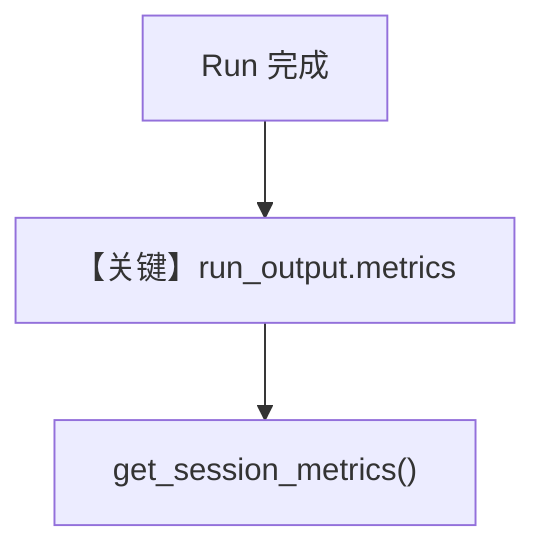

# 01_team_metrics.py — 实现原理分析

> 源文件：`cookbook/03_teams/22_metrics/01_team_metrics.py`

## 概述

本示例展示 **`run_output.metrics`**、**`get_session_metrics()`** 与 **`member_responses` 上的 metrics**（`store_member_responses=True` 时）：PostgreSQL 会话表持久化。

**核心配置一览：** 见 `.py`——`PostgresDb`、`OpenAIResponses` 或 `OpenAIChat`（以当前文件为准）、`YFinanceTools`、`session_id`。

## 运行机制与因果链

单次 `team.run` 后打印聚合指标；会话级指标跨 run 累积。

## System Prompt 组装

与标准 Team 一致；metrics **不参与** prompt，属运行元数据。

## Mermaid 流程图

```mermaid
flowchart TD
    R["Run 完成"] --> M["【关键】run_output.metrics"]
    M --> SM["get_session_metrics()"]
```

## 关键源码文件索引

| 文件 | 作用 |
|------|------|
| `agno/run/team/` | `TeamRunOutput.metrics` |
