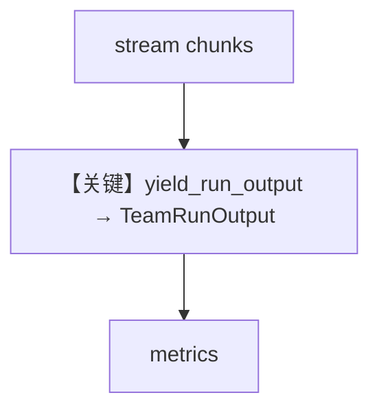

# 02_team_streaming_metrics.py — 实现原理分析

> 源文件：`cookbook/03_teams/22_metrics/02_team_streaming_metrics.py`

## 概述

本示例展示 **流式 Team 响应末尾汇总 metrics**：使用 **`yield_run_output=True`**（或 API 等价）在流结束后拿到完整 `TeamRunOutput` 再打印 metrics。

## 运行机制与因果链

无 `yield_run_output` 时仅 chunk 流可能缺最终聚合计时/token。

## Mermaid 流程图

## 关键源码文件索引

| 文件 | 作用 |
|------|------|
| `agno/team/team.py` | `print_response`/`arun` stream 参数 |
