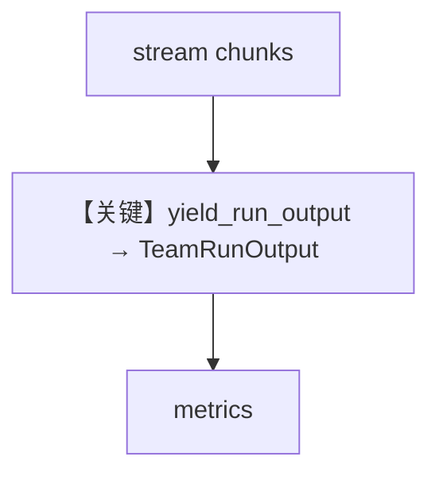

# 02_team_streaming_metrics.py — 实现原理分析

<!-- cookbook-py-source:start -->
## 完整源码

```python
"""
Team Streaming Metrics
=============================

Demonstrates how to capture metrics from team streaming responses.
Use yield_run_output=True to receive a TeamRunOutput at the end of the stream.
"""

from agno.agent import Agent
from agno.models.openai import OpenAIChat
from agno.run.team import TeamRunOutput
from agno.team import Team
from rich.pretty import pprint

# ---------------------------------------------------------------------------
# Create Members
# ---------------------------------------------------------------------------
assistant = Agent(
    name="Assistant",
    model=OpenAIChat(id="gpt-4o-mini"),
    role="Helpful assistant that answers questions.",
)

# ---------------------------------------------------------------------------
# Create Team
# ---------------------------------------------------------------------------
team = Team(
    name="Streaming Team",
    model=OpenAIChat(id="gpt-4o-mini"),
    members=[assistant],
    markdown=True,
)

# ---------------------------------------------------------------------------
# Run Team (Streaming)
# ---------------------------------------------------------------------------
if __name__ == "__main__":
    response = None
    for event in team.run("Count from 1 to 5.", stream=True, yield_run_output=True):
        if isinstance(event, TeamRunOutput):
            response = event

    if response and response.metrics:
        print("=" * 50)
        print("STREAMING TEAM METRICS")
        print("=" * 50)
        pprint(response.metrics)

        print("=" * 50)
        print("MODEL DETAILS")
        print("=" * 50)
        if response.metrics.details:
            for model_type, model_metrics_list in response.metrics.details.items():
                print(f"\n{model_type}:")
                for model_metric in model_metrics_list:
                    pprint(model_metric)
```

<!-- cookbook-py-source:end -->

> 源文件：`cookbook/03_teams/22_metrics/02_team_streaming_metrics.py`

## 概述

本示例展示 **流式 Team 响应末尾汇总 metrics**：使用 **`yield_run_output=True`**（或 API 等价）在流结束后拿到完整 `TeamRunOutput` 再打印 metrics。

## 运行机制与因果链

无 `yield_run_output` 时仅 chunk 流可能缺最终聚合计时/token。

## Mermaid 流程图



## 关键源码文件索引

| 文件 | 作用 |
|------|------|
| `agno/team/team.py` | `print_response`/`arun` stream 参数 |
