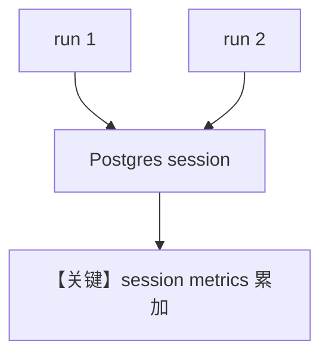

# 03_team_session_metrics.py — 实现原理分析

> 源文件：`cookbook/03_teams/22_metrics/03_team_session_metrics.py`

## 概述

本示例展示 **同一会话多次 Team run 的 metrics 累积**（PostgreSQL），强调 session 级聚合与持久化。

## 运行机制与因果链

多次 `print_response`/`run` 共享 `session_id`，`get_session_metrics()` 反映累计值。

## Mermaid 流程图

## 关键源码文件索引

| 文件 | 作用 |
|------|------|
| `agno/db/postgres.py` | session 存储 |
