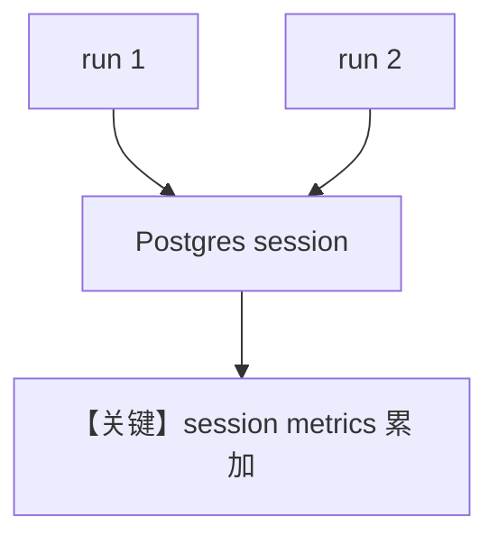

# 03_team_session_metrics.py — 实现原理分析

<!-- cookbook-py-source:start -->
## 完整源码

```python
"""
Team Session Metrics
=============================

Demonstrates session-level metrics for teams with PostgreSQL persistence.
Metrics accumulate across multiple team runs within the same session.

Run: ./cookbook/scripts/run_pgvector.sh
"""

from agno.agent import Agent
from agno.db.postgres import PostgresDb
from agno.models.openai import OpenAIChat
from agno.team import Team
from rich.pretty import pprint

# ---------------------------------------------------------------------------
# Setup
# ---------------------------------------------------------------------------
db_url = "postgresql+psycopg://ai:ai@localhost:5532/ai"
db = PostgresDb(db_url=db_url, session_table="team_metrics_sessions")

# ---------------------------------------------------------------------------
# Create Members
# ---------------------------------------------------------------------------
assistant = Agent(
    name="Assistant",
    model=OpenAIChat(id="gpt-4o-mini"),
    role="Helpful assistant that answers questions.",
)

# ---------------------------------------------------------------------------
# Create Team
# ---------------------------------------------------------------------------
team = Team(
    name="Research Team",
    model=OpenAIChat(id="gpt-4o-mini"),
    members=[assistant],
    db=db,
    session_id="team_session_metrics_demo",
    markdown=True,
)

# ---------------------------------------------------------------------------
# Run Team
# ---------------------------------------------------------------------------
if __name__ == "__main__":
    # First run
    run_output_1 = team.run("What is the capital of Japan?")
    print("=" * 50)
    print("RUN 1 METRICS")
    print("=" * 50)
    pprint(run_output_1.metrics)

    # Second run on the same session
    run_output_2 = team.run("What about South Korea?")
    print("=" * 50)
    print("RUN 2 METRICS")
    print("=" * 50)
    pprint(run_output_2.metrics)

    # Session metrics aggregate both runs
    print("=" * 50)
    print("SESSION METRICS (accumulated)")
    print("=" * 50)
    session_metrics = team.get_session_metrics()
    pprint(session_metrics)
```

<!-- cookbook-py-source:end -->

> 源文件：`cookbook/03_teams/22_metrics/03_team_session_metrics.py`

## 概述

本示例展示 **同一会话多次 Team run 的 metrics 累积**（PostgreSQL），强调 session 级聚合与持久化。

## 运行机制与因果链

多次 `print_response`/`run` 共享 `session_id`，`get_session_metrics()` 反映累计值。

## Mermaid 流程图



## 关键源码文件索引

| 文件 | 作用 |
|------|------|
| `agno/db/postgres.py` | session 存储 |
