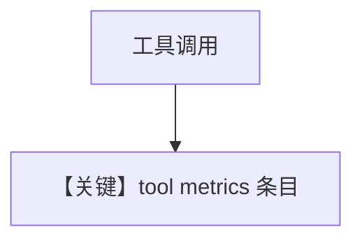

# 04_team_tool_metrics.py — 实现原理分析

> 源文件：`cookbook/03_teams/22_metrics/04_team_tool_metrics.py`

## 概述

本示例展示 **成员使用工具时的指标细分**：队长 metrics、成员 metrics、**工具执行耗时** 等 `metrics.details` 条目。

## 运行机制与因果链

工具调用循环中每次 tool round-trip 计入计时；YFinance 等网络工具体现明显。

## Mermaid 流程图

## 关键源码文件索引

| 文件 | 作用 |
|------|------|
| `agno/models/metrics.py` | `MessageMetrics` |
