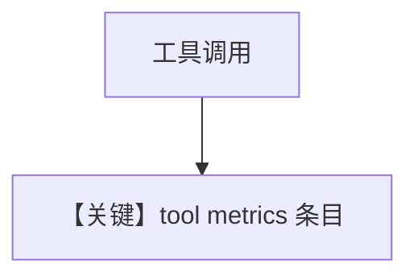

# 04_team_tool_metrics.py — 实现原理分析

<!-- cookbook-py-source:start -->
## 完整源码

```python
"""
Team Tool Metrics
=============================

Demonstrates metrics for teams where members use tools.
Shows leader metrics, member metrics, and tool execution timing.
"""

from agno.agent import Agent
from agno.models.openai import OpenAIChat
from agno.team import Team
from agno.tools.yfinance import YFinanceTools
from rich.pretty import pprint

# ---------------------------------------------------------------------------
# Create Members
# ---------------------------------------------------------------------------
stock_searcher = Agent(
    name="Stock Searcher",
    model=OpenAIChat(id="gpt-4o-mini"),
    role="Searches for stock information.",
    tools=[YFinanceTools()],
)

# ---------------------------------------------------------------------------
# Create Team
# ---------------------------------------------------------------------------
team = Team(
    name="Stock Research Team",
    model=OpenAIChat(id="gpt-4o-mini"),
    members=[stock_searcher],
    markdown=True,
    show_members_responses=True,
    store_member_responses=True,
)

# ---------------------------------------------------------------------------
# Run Team
# ---------------------------------------------------------------------------
if __name__ == "__main__":
    run_output = team.run("What is the stock price of NVDA?")

    # Aggregated team metrics (leader + all members)
    print("=" * 50)
    print("AGGREGATED TEAM METRICS")
    print("=" * 50)
    pprint(run_output.metrics)

    # Member-level metrics and tool calls
    print("=" * 50)
    print("MEMBER METRICS AND TOOL CALLS")
    print("=" * 50)
    if run_output.member_responses:
        for member_response in run_output.member_responses:
            print(f"\nMember: {member_response.agent_name}")
            print("-" * 40)
            pprint(member_response.metrics)

            if member_response.tools:
                print(f"\nTool calls ({len(member_response.tools)}):")
                for tool_call in member_response.tools:
                    print(f"  Tool: {tool_call.tool_name}")
                    if tool_call.metrics:
                        pprint(tool_call.metrics)
```

<!-- cookbook-py-source:end -->

> 源文件：`cookbook/03_teams/22_metrics/04_team_tool_metrics.py`

## 概述

本示例展示 **成员使用工具时的指标细分**：队长 metrics、成员 metrics、**工具执行耗时** 等 `metrics.details` 条目。

## 运行机制与因果链

工具调用循环中每次 tool round-trip 计入计时；YFinance 等网络工具体现明显。

## Mermaid 流程图



## 关键源码文件索引

| 文件 | 作用 |
|------|------|
| `agno/models/metrics.py` | `MessageMetrics` |
