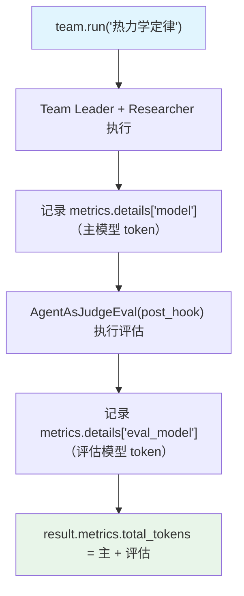

# 05_team_eval_metrics.py — 实现原理分析

> 源文件：`cookbook/03_teams/22_metrics/05_team_eval_metrics.py`

## 概述

本示例展示 **评估模型指标的追踪**：`AgentAsJudgeEval` 作为 `post_hook` 在 Team 运行后执行质量评估，评估模型（`gpt-4o-mini`）的 token 消耗单独记录在 `metrics.details["eval_model"]` 下，与 Team 自身的 `metrics.details["model"]` 分离，实现精细的成本归因。

**核心配置一览：**

| 配置项 | 值 | 说明 |
|--------|------|------|
| `post_hooks` | `[AgentAsJudgeEval(...)]` | 运行后质量评估 |
| `scoring_strategy` | `"binary"` | 二值评分（通过/不通过） |
| 评估指标位置 | `metrics.details["eval_model"]` | 与主模型指标分离 |

## 核心组件解析

### `AgentAsJudgeEval` 作为后处理钩子

```python
eval_hook = AgentAsJudgeEval(
    name="Quality Check",
    model=OpenAIChat(id="gpt-4o-mini"),
    criteria="Response should be accurate, well-structured, and concise",
    scoring_strategy="binary",  # 0 或 1
)

team = Team(
    post_hooks=[eval_hook],
    ...
)
```

### 指标分离读取

```python
result = team.run("What are the three laws of thermodynamics?")

# 主模型 token
team_tokens = sum(m.total_tokens for m in result.metrics.details.get("model", []))

# 评估模型 token（独立计费）
eval_tokens = sum(m.total_tokens for m in result.metrics.details.get("eval_model", []))

total = result.metrics.total_tokens  # 两者之和
```

### 使用场景

- 在生产环境中监控评估成本是否合理
- 将评估 token 从主响应 token 中分离计费
- 追踪评估模型的性能（响应时间）

## Mermaid 流程图



## 关键源码文件索引

| 文件 | 关键函数/类 | 作用 |
|------|------------|------|
| `agno/eval/agent_as_judge.py` | `AgentAsJudgeEval` | LLM 质量评估器 |
| `agno/run/base.py` | `RunMetrics.details` | 按类型分解的指标 |
