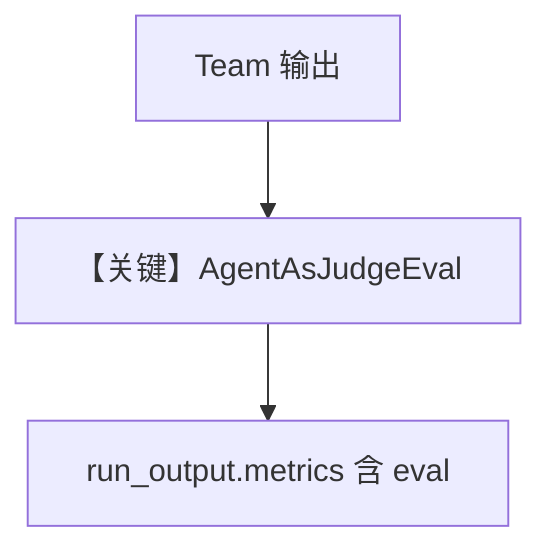

# 05_team_eval_metrics.py — 实现原理分析

> 源文件：`cookbook/03_teams/22_metrics/05_team_eval_metrics.py`

## 概述

本示例展示 **`AgentAsJudgeEval` 作为 `post_hook`**：裁判模型对 Team 输出打分后，**eval 指标合并回** `run_output.metrics`。

## 运行机制与因果链

post_hook 在最终输出后执行；额外 LLM 调用产生成本与延迟。

## Mermaid 流程图

```mermaid
flowchart TD
    O["Team 输出"] --> E["【关键】AgentAsJudgeEval"]
    E --> M["run_output.metrics 含 eval"]
```

## 关键源码文件索引

| 文件 | 作用 |
|------|------|
| `agno/eval/agent_as_judge.py` | `AgentAsJudgeEval` |
