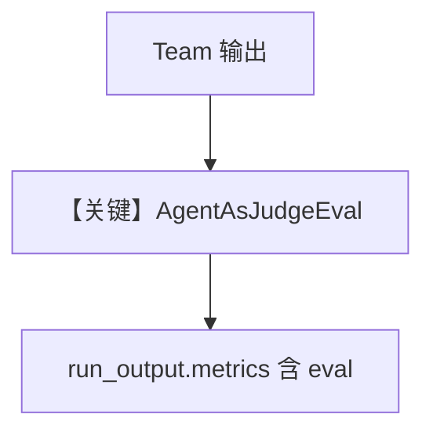

# 05_team_eval_metrics.py — 实现原理分析

<!-- cookbook-py-source:start -->
## 完整源码

```python
"""
Team Eval Metrics
=============================

Demonstrates that eval model metrics are accumulated back into the
team's run_output when AgentAsJudgeEval is used as a post_hook.

After the team runs, the evaluator agent makes its own model call.
Those eval tokens show up under "eval_model" in run_output.metrics.details,
separate from the team's own model tokens.
"""

from agno.agent import Agent
from agno.eval.agent_as_judge import AgentAsJudgeEval
from agno.models.openai import OpenAIChat
from agno.team import Team
from rich.pretty import pprint

# ---------------------------------------------------------------------------
# Create eval as a post-hook
# ---------------------------------------------------------------------------
eval_hook = AgentAsJudgeEval(
    name="Quality Check",
    model=OpenAIChat(id="gpt-4o-mini"),
    criteria="Response should be accurate, well-structured, and concise",
    scoring_strategy="binary",
)

# ---------------------------------------------------------------------------
# Create Team
# ---------------------------------------------------------------------------
researcher = Agent(
    name="Researcher",
    model=OpenAIChat(id="gpt-4o-mini"),
    role="Research topics and provide factual information.",
)

team = Team(
    name="Research Team",
    model=OpenAIChat(id="gpt-4o-mini"),
    members=[researcher],
    post_hooks=[eval_hook],
    show_members_responses=True,
    store_member_responses=True,
)

# ---------------------------------------------------------------------------
# Run Team
# ---------------------------------------------------------------------------
if __name__ == "__main__":
    result = team.run("What are the three laws of thermodynamics?")

    if result.metrics:
        print("Total tokens (team + eval):", result.metrics.total_tokens)

        if result.metrics.details:
            # Team's own model calls
            if "model" in result.metrics.details:
                team_tokens = sum(
                    metric.total_tokens for metric in result.metrics.details["model"]
                )
                print("Team model tokens:", team_tokens)

            # Eval model call
            if "eval_model" in result.metrics.details:
                eval_tokens = sum(
                    metric.total_tokens
                    for metric in result.metrics.details["eval_model"]
                )
                print("Eval model tokens:", eval_tokens)
                for metric in result.metrics.details["eval_model"]:
                    print(f"  Evaluator: {metric.id} ({metric.provider})")

            print("\n" + "=" * 50)
            print("FULL METRICS")
            print("=" * 50)
            pprint(result.metrics)

            print("\n" + "=" * 50)
            print("MODEL DETAILS")
            print("=" * 50)
            for model_type, model_metrics_list in result.metrics.details.items():
                print(f"\n{model_type}:")
                for model_metric in model_metrics_list:
                    pprint(model_metric)
```

<!-- cookbook-py-source:end -->

> 源文件：`cookbook/03_teams/22_metrics/05_team_eval_metrics.py`

## 概述

本示例展示 **`AgentAsJudgeEval` 作为 `post_hook`**：裁判模型对 Team 输出打分后，**eval 指标合并回** `run_output.metrics`。

## 运行机制与因果链

post_hook 在最终输出后执行；额外 LLM 调用产生成本与延迟。

## Mermaid 流程图


```mermaid
flowchart TD
    O["Team 输出"] --> E["【关键】AgentAsJudgeEval"]
    E --> M["run_output.metrics 含 eval"]
```

## 关键源码文件索引

| 文件 | 作用 |
|------|------|
| `agno/eval/agent_as_judge.py` | `AgentAsJudgeEval` |
