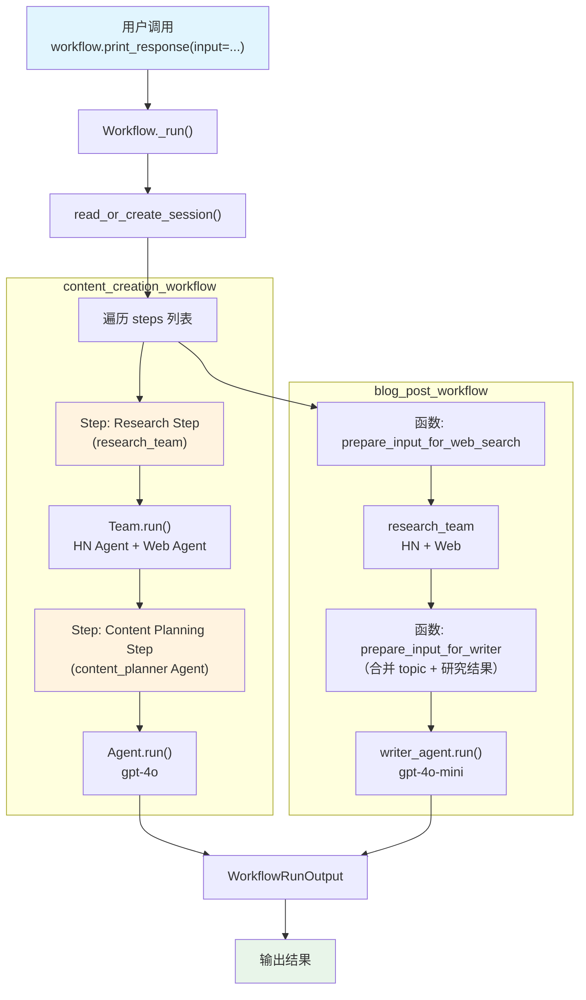

# sequence_of_steps.py — 实现原理分析

> 源文件：`cookbook/04_workflows/01_basic_workflows/01_sequence_of_steps/sequence_of_steps.py`

## 概述

本示例展示 Agno Workflow 的 **`顺序步骤执行`** 机制：通过 `Workflow(steps=[...])` 将 Agent、Team、函数步骤串联为线性流水线，支持同步、异步、流式及事件流式四种运行模式。

**核心配置一览：**

| 配置项 | 值 | 说明 |
|--------|------|------|
| `Workflow.name` | `"Content Creation Workflow"` / `"Blog Post Workflow"` | 两个 Workflow 示例 |
| `Workflow.db` | `SqliteDb(session_table="workflow_session")` | SQLite 持久化会话 |
| `Workflow.steps` | `[research_step, content_planning_step]` / `[fn, team, fn, agent]` | 顺序步骤列表 |
| `Step.team` | `research_team` | 步骤执行者为 Team |
| `Step.agent` | `content_planner` | 步骤执行者为 Agent |
| 函数步骤签名 | `async def f(step_input) -> AsyncIterator[StepOutput]` | 异步生成器函数步骤 |

## 架构分层

```
用户代码层                           agno.workflow 层
┌─────────────────────────────┐    ┌────────────────────────────────────────┐
│ sequence_of_steps.py        │    │ Workflow._run()                        │
│                             │    │  ├─ 1. read_or_create_session()        │
│ content_creation_workflow   │───>│  ├─ 2. 遍历 steps 列表                 │
│   steps=[                   │    │  │   ├─ Step._run()                    │
│     research_step(team),    │    │  │   │   └─ Team.run() / Agent.run()   │
│     content_planning_step   │    │  │   └─ 函数步骤直接调用               │
│   ]                         │    │  ├─ 3. 传递 StepInput/StepOutput       │
│                             │    │  └─ 4. 聚合为 WorkflowRunOutput        │
│ blog_post_workflow          │    └────────────────────────────────────────┘
│   steps=[fn, team, fn, agent│
│   ]                         │              │
└─────────────────────────────┘              ▼
                                    ┌────────────────────┐
                                    │ OpenAIChat         │
                                    │ gpt-4o / gpt-4o-mini│
                                    └────────────────────┘
```

## 核心组件解析

### Workflow

`Workflow` 是 Agno 工作流的核心容器，定义于 `agno/workflow/workflow.py`。`steps` 参数接受以下类型的列表：
- `Step` 对象（包装 Agent 或 Team）
- 函数（签名为 `StepInput → StepOutput | Iterator | AsyncIterator`）
- `Agent` / `Team` 对象（直接放入 steps，自动包装为 Step）

```python
# content_creation_workflow 使用 Step 对象
content_creation_workflow = Workflow(
    name="Content Creation Workflow",
    db=SqliteDb(session_table="workflow_session", db_file="tmp/workflow.db"),
    steps=[research_step, content_planning_step],  # Step 对象列表
)

# blog_post_workflow 混合使用函数和 Team/Agent
blog_post_workflow = Workflow(
    steps=[
        prepare_input_for_web_search,  # 异步生成器函数
        research_team,                 # Team 对象（自动包装）
        prepare_input_for_writer,      # 异步生成器函数
        writer_agent,                  # Agent 对象（自动包装）
    ]
)
```

### Step

`Step` 是单个执行单元，封装 Agent 或 Team：

```python
research_step = Step(
    name="Research Step",
    team=research_team,   # 使用 Team 作为执行者
)

content_planning_step = Step(
    name="Content Planning Step",
    agent=content_planner,  # 使用 Agent 作为执行者
)
```

### 函数步骤（Function Steps）

函数步骤是直接的 Python 函数，接受 `StepInput` 并返回 `StepOutput` 或其迭代器：

```python
async def prepare_input_for_web_search(
    step_input: StepInput,
) -> AsyncIterator[StepOutput]:
    topic = step_input.input  # 获取原始输入
    content = f"..blog topic: {topic}..."
    yield StepOutput(content=content)  # 流式产出结果

async def prepare_input_for_writer(step_input: StepInput) -> AsyncIterator[StepOutput]:
    topic = step_input.input
    research_team_output = step_input.previous_step_content  # 获取上一步输出
    content = f"...topic: {topic}, research: {research_team_output}..."
    yield StepOutput(content=content)
```

### StepInput / StepOutput

步骤间数据传递的核心类型：

| 字段 | 类型 | 说明 |
|------|------|------|
| `StepInput.input` | `str/dict/BaseModel` | 工作流原始输入（贯穿所有步骤） |
| `StepInput.previous_step_content` | `str` | 前一步骤的输出内容 |
| `StepInput.previous_step_outputs` | `Dict[str, StepOutput]` | 所有前置步骤的输出 |
| `StepOutput.content` | `str` | 本步骤输出内容 |
| `StepOutput.stop` | `bool` | 为 `True` 时提前终止工作流 |

### 事件流式模式

```python
async def stream_run_events() -> None:
    events = blog_post_workflow.arun(
        input="AI trends in 2024",
        stream=True,
        stream_events=True,  # 启用事件流
    )
    async for event in events:
        if event.event == WorkflowRunEvent.step_started.value:
            print(event)  # 步骤开始事件
        elif event.event == WorkflowRunEvent.step_completed.value:
            print(event)  # 步骤完成事件
```

## 工作流执行流

| 步骤 | 执行者 | 输入来源 | 输出 |
|------|--------|---------|------|
| 1. Research Step | `research_team` (HN + Web) | 原始 input | 研究内容 |
| 2. Content Planning Step | `content_planner` Agent | previous_step_content | 内容计划 |

Blog Post Workflow 流：

| 步骤 | 执行者 | 输入来源 |
|------|--------|---------|
| 1. prepare_input_for_web_search | 函数 | step_input.input |
| 2. research_team | Team | 函数输出（web search prompt） |
| 3. prepare_input_for_writer | 函数 | step_input.previous_step_content（研究结果） |
| 4. writer_agent | Agent | 函数输出（写作 prompt） |

## 运行模式对比

| 模式 | 调用方式 | 适用场景 |
|------|---------|---------|
| 同步 | `workflow.print_response(input=...)` | 简单测试 |
| 同步流式 | `workflow.print_response(stream=True)` | 实时显示步骤输出 |
| 异步 | `asyncio.run(workflow.aprint_response(...))` | 生产环境 |
| 异步流式 | `asyncio.run(workflow.aprint_response(stream=True))` | 实时流式生产 |
| 事件流 | `workflow.arun(stream_events=True)` | 细粒度事件监控 |

## Mermaid 流程图



## 关键源码文件索引

| 文件 | 关键类/函数 | 作用 |
|------|------------|------|
| `agno/workflow/workflow.py` | `Workflow` L1 | 工作流容器，管理步骤列表和会话 |
| `agno/workflow/step.py` | `Step` L59 | 单步执行单元（封装 Agent/Team/executor） |
| `agno/workflow/types.py` | `StepInput` L98, `StepOutput` L334 | 步骤输入/输出数据类型 |
| `agno/run/workflow.py` | `WorkflowRunEvent` | 工作流事件枚举（step_started 等） |
| `agno/db/sqlite/` | `SqliteDb` | SQLite 会话持久化 |
