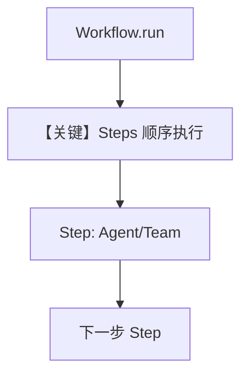

# sequence_of_steps.py — 实现原理分析

<!-- cookbook-py-source:start -->
## 完整源码

```python
"""
Sequence Of Steps
=================

Demonstrates sequential workflow execution with sync, async, streaming, and event-streaming run modes.
"""

import asyncio
from textwrap import dedent
from typing import AsyncIterator

from agno.agent import Agent
from agno.db.sqlite import SqliteDb
from agno.models.openai import OpenAIChat
from agno.run.workflow import WorkflowRunEvent, WorkflowRunOutputEvent
from agno.team import Team
from agno.tools.hackernews import HackerNewsTools
from agno.tools.websearch import WebSearchTools
from agno.workflow.step import Step
from agno.workflow.types import StepInput, StepOutput
from agno.workflow.workflow import Workflow

# ---------------------------------------------------------------------------
# Create Agents
# ---------------------------------------------------------------------------
hackernews_agent = Agent(
    name="Hackernews Agent",
    model=OpenAIChat(id="gpt-4o-mini"),
    tools=[HackerNewsTools()],
    role="Extract key insights and content from Hackernews posts",
)

web_agent = Agent(
    name="Web Agent",
    model=OpenAIChat(id="gpt-4o-mini"),
    tools=[WebSearchTools()],
    role="Search the web for the latest news and trends",
)

content_planner = Agent(
    name="Content Planner",
    model=OpenAIChat(id="gpt-4o"),
    instructions=[
        "Plan a content schedule over 4 weeks for the provided topic and research content",
        "Ensure that I have posts for 3 posts per week",
    ],
)

writer_agent = Agent(
    name="Writer Agent",
    model=OpenAIChat(id="gpt-4o-mini"),
    instructions="Write a blog post on the topic",
)

# ---------------------------------------------------------------------------
# Create Team
# ---------------------------------------------------------------------------
research_team = Team(
    name="Research Team",
    members=[hackernews_agent, web_agent],
    instructions="Research tech topics from Hackernews and the web",
)

# ---------------------------------------------------------------------------
# Define Steps
# ---------------------------------------------------------------------------
research_step = Step(
    name="Research Step",
    team=research_team,
)

content_planning_step = Step(
    name="Content Planning Step",
    agent=content_planner,
)


async def prepare_input_for_web_search(
    step_input: StepInput,
) -> AsyncIterator[StepOutput]:
    topic = step_input.input
    content = dedent(
        f"""\
        I'm writing a blog post on the topic
        <topic>
        {topic}
        </topic>

        Search the web for atleast 10 articles\
        """
    )
    yield StepOutput(content=content)


async def prepare_input_for_writer(step_input: StepInput) -> AsyncIterator[StepOutput]:
    topic = step_input.input
    research_team_output = step_input.previous_step_content
    content = dedent(
        f"""\
        I'm writing a blog post on the topic:
        <topic>
        {topic}
        </topic>

        Here is information from the web:
        <research_results>
        {research_team_output}
        </research_results>\
        """
    )
    yield StepOutput(content=content)


# ---------------------------------------------------------------------------
# Create Workflows
# ---------------------------------------------------------------------------
content_creation_workflow = Workflow(
    name="Content Creation Workflow",
    description="Automated content creation from blog posts to social media",
    db=SqliteDb(
        session_table="workflow_session",
        db_file="tmp/workflow.db",
    ),
    steps=[research_step, content_planning_step],
)

blog_post_workflow = Workflow(
    name="Blog Post Workflow",
    description="Automated blog post creation from Hackernews and the web",
    db=SqliteDb(
        session_table="workflow_session",
        db_file="tmp/workflow.db",
    ),
    steps=[
        prepare_input_for_web_search,
        research_team,
        prepare_input_for_writer,
        writer_agent,
    ],
)


async def stream_run_events() -> None:
    events: AsyncIterator[WorkflowRunOutputEvent] = blog_post_workflow.arun(
        input="AI trends in 2024",
        markdown=True,
        stream=True,
        stream_events=True,
    )
    async for event in events:
        if event.event == WorkflowRunEvent.condition_execution_started.value:
            print(event)
            print()
        elif event.event == WorkflowRunEvent.condition_execution_completed.value:
            print(event)
            print()
        elif event.event == WorkflowRunEvent.workflow_started.value:
            print(event)
            print()
        elif event.event == WorkflowRunEvent.step_started.value:
            print(event)
            print()
        elif event.event == WorkflowRunEvent.step_completed.value:
            print(event)
            print()
        elif event.event == WorkflowRunEvent.workflow_completed.value:
            print(event)
            print()


# ---------------------------------------------------------------------------
# Run Workflow
# ---------------------------------------------------------------------------
if __name__ == "__main__":
    # Sync
    content_creation_workflow.print_response(
        input="AI trends in 2024",
        markdown=True,
    )

    # Sync Streaming
    content_creation_workflow.print_response(
        input="AI trends in 2024",
        markdown=True,
        stream=True,
    )

    # Async
    asyncio.run(
        content_creation_workflow.aprint_response(
            input="AI agent frameworks 2025",
            markdown=True,
        )
    )

    # Async Streaming
    asyncio.run(
        content_creation_workflow.aprint_response(
            input="AI agent frameworks 2025",
            markdown=True,
            stream=True,
        )
    )

    # Async Run Stream Events
    asyncio.run(stream_run_events())
```

<!-- cookbook-py-source:end -->

> 源文件：`cookbook/04_workflows/01_basic_workflows/01_sequence_of_steps/sequence_of_steps.py`

## 概述

本示例展示 **`Workflow` 顺序多 `Step`**：串联 Hackernews / Web / Planner / Writer 等 **Agent 或 Team**，并演示 **sync、async、stream、stream_events** 等运行模式；可选 `SqliteDb` 持久化。

## 架构分层

```
用户脚本 → Workflow.run / arun
    → Steps.execute 循环（libs/agno/agno/workflow/steps.py）
    → 每步 Step.execute → 内部 Agent.run / Team.run
    → OpenAIChat → chat.completions.create
```

## System Prompt 组装

**不存在单一 Workflow 级 `get_system_message`**。每个 **Agent** 仍通过 `agno/agent/_messages.py` 各自拼装 system；本文件需在文档中按步骤列出各 Agent 的 `instructions`（从 `.py` 原样引用）。

## 完整 API 请求

步骤内模型为 **`OpenAIChat`** → **`chat.completions.create`**（`gpt-4o-mini` / `gpt-4o` 等，以源码为准）。

## Mermaid 流程图


```mermaid
flowchart TD
    W["Workflow.run"] --> S["【关键】Steps 顺序执行"]
    S --> A1["Step: Agent/Team"]
    A1 --> A2["下一步 Step"]
```

## 关键源码文件索引

| 文件 | 作用 |
|------|------|
| `agno/workflow/workflow.py` | `Workflow.run` L6410+ |
| `agno/workflow/steps.py` | `Steps.execute` L236+ |
