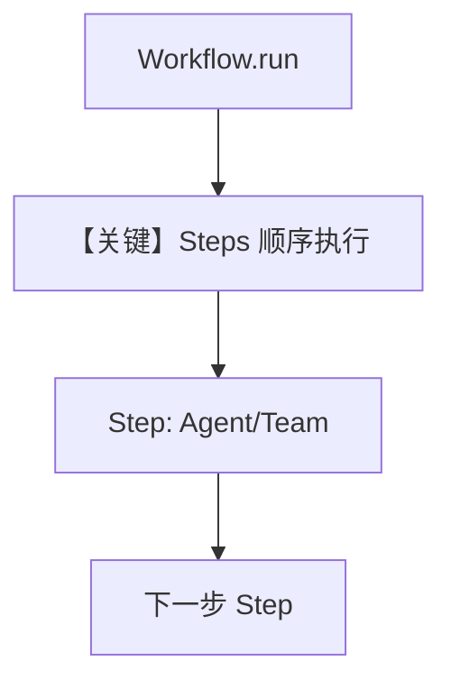

# sequence_of_steps.py — 实现原理分析

> 源文件：`cookbook/04_workflows/01_basic_workflows/01_sequence_of_steps/sequence_of_steps.py`

## 概述

本示例展示 **`Workflow` 顺序多 `Step`**：串联 Hackernews / Web / Planner / Writer 等 **Agent 或 Team**，并演示 **sync、async、stream、stream_events** 等运行模式；可选 `SqliteDb` 持久化。

## 架构分层

```
用户脚本 → Workflow.run / arun
    → Steps.execute 循环（libs/agno/agno/workflow/steps.py）
    → 每步 Step.execute → 内部 Agent.run / Team.run
    → OpenAIChat → chat.completions.create
```

## System Prompt 组装

**不存在单一 Workflow 级 `get_system_message`**。每个 **Agent** 仍通过 `agno/agent/_messages.py` 各自拼装 system；本文件需在文档中按步骤列出各 Agent 的 `instructions`（从 `.py` 原样引用）。

## 完整 API 请求

步骤内模型为 **`OpenAIChat`** → **`chat.completions.create`**（`gpt-4o-mini` / `gpt-4o` 等，以源码为准）。

## Mermaid 流程图


```mermaid
flowchart TD
    W["Workflow.run"] --> S["【关键】Steps 顺序执行"]
    S --> A1["Step: Agent/Team"]
    A1 --> A2["下一步 Step"]
```

## 关键源码文件索引

| 文件 | 作用 |
|------|------|
| `agno/workflow/workflow.py` | `Workflow.run` L6410+ |
| `agno/workflow/steps.py` | `Steps.execute` L236+ |
