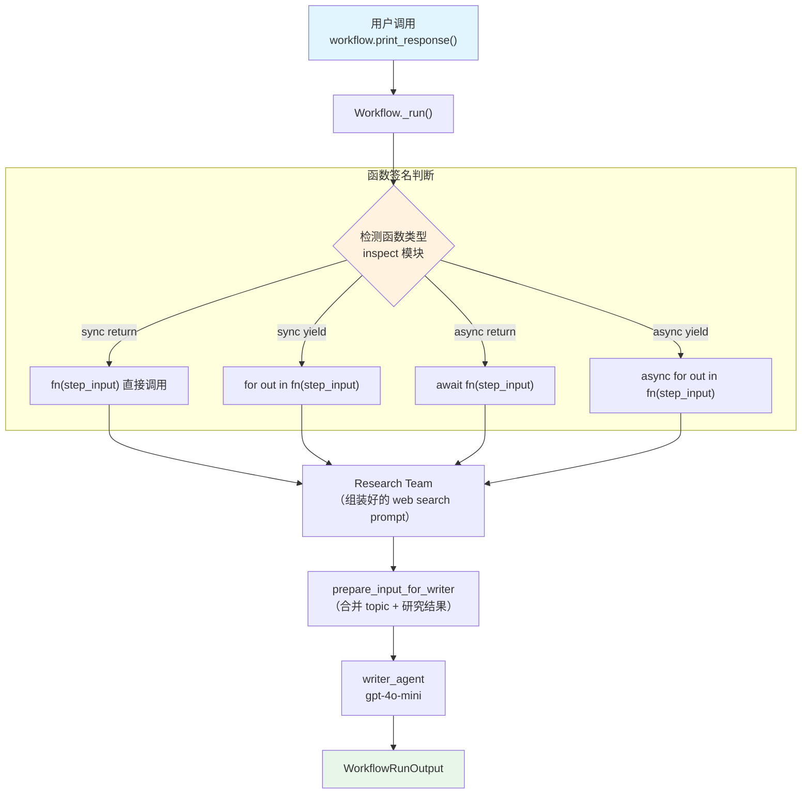

# sequence_with_functions.py — 实现原理分析

> 源文件：`cookbook/04_workflows/01_basic_workflows/01_sequence_of_steps/sequence_with_functions.py`

## 概述

本示例展示 Agno Workflow 的 **`函数步骤四种签名模式`** 机制：同一逻辑通过 sync/async × return/yield 四种函数形式实现，每种形式对应不同的运行上下文，展示 Workflow 对多种函数签名的自动识别和路由。

**核心配置一览：**

| 配置项 | 值 | 说明 |
|--------|------|------|
| `Workflow.name` | `"Blog Post Workflow"` | 四个 Workflow 变体 |
| `Workflow.db` | `SqliteDb(session_table="workflow_session")` | SQLite 持久化 |
| 函数签名 1 | `sync → StepOutput` | 同步返回 |
| 函数签名 2 | `sync → Iterator[StepOutput]` | 同步生成器 |
| 函数签名 3 | `async → StepOutput` | 异步协程 |
| 函数签名 4 | `async → AsyncIterator[StepOutput]` | 异步生成器 |

## 架构分层

```
用户代码层                           agno.workflow 层
┌─────────────────────────────┐    ┌────────────────────────────────────────┐
│ sequence_with_functions.py  │    │ Workflow._run() / Workflow._arun()     │
│                             │    │  ├─ 识别函数类型（inspect.iscoroutine） │
│ sync_workflow               │───>│  ├─ sync fn    → 直接调用              │
│   steps=[fn_sync, team,     │    │  ├─ sync iter  → 逐个产出              │
│          fn_sync, writer]   │    │  ├─ async fn   → await 调用            │
│                             │    │  └─ async iter → 异步逐个产出          │
│ async_stream_workflow       │    └────────────────────────────────────────┘
│   steps=[fn_async_stream,   │
│          team, fn_as, agent]│              │
└─────────────────────────────┘              ▼
                                    ┌────────────────────┐
                                    │ OpenAIChat         │
                                    │ gpt-4o-mini        │
                                    └────────────────────┘
```

## 核心组件解析

### 四种函数签名模式

```python
# 1. 同步返回（sync return）
def prepare_input_for_web_search_sync(step_input: StepInput) -> StepOutput:
    return StepOutput(content=f"...{step_input.input}...")

# 2. 同步生成器（sync yield）
def prepare_input_for_web_search_sync_stream(step_input: StepInput) -> Iterator[StepOutput]:
    yield StepOutput(content=f"...{step_input.input}...")

# 3. 异步返回（async return）
async def prepare_input_for_web_search_async(step_input: StepInput) -> StepOutput:
    return StepOutput(content=f"...{step_input.input}...")

# 4. 异步生成器（async yield）
async def prepare_input_for_web_search_async_stream(
    step_input: StepInput,
) -> AsyncIterator[StepOutput]:
    yield StepOutput(content=f"...{step_input.input}...")
```

### 前置步骤内容访问

所有四种函数签名都可以通过 `step_input.previous_step_content` 访问前一步骤的输出：

```python
def prepare_input_for_writer_sync(step_input: StepInput) -> StepOutput:
    topic = step_input.input                         # 原始输入（始终保持）
    research_team_output = step_input.previous_step_content  # 前一步（research_team）的输出
    content = f"topic: {topic}, research: {research_team_output}"
    return StepOutput(content=content)
```

### 四个 Workflow 变体

```python
sync_workflow = Workflow(
    steps=[prepare_input_for_web_search_sync, research_team,  # 同步函数
           prepare_input_for_writer_sync, writer_agent],
)
sync_stream_workflow = Workflow(
    steps=[prepare_input_for_web_search_sync_stream, research_team,
           prepare_input_for_writer_sync_stream, writer_agent],
)
async_workflow = Workflow(
    steps=[prepare_input_for_web_search_async, research_team, ...],
)
async_stream_workflow = Workflow(
    steps=[prepare_input_for_web_search_async_stream, research_team, ...],
)
```

## 函数签名识别机制

Workflow 在执行步骤时通过 `inspect` 模块自动检测函数类型：

| 检测条件 | 执行方式 |
|---------|---------|
| `inspect.iscoroutinefunction(fn)` = True | `await fn(step_input)` |
| `inspect.isasyncgenfunction(fn)` = True | `async for out in fn(step_input)` |
| 返回值是 `Iterator` | `for out in fn(step_input)` |
| 普通同步函数 | `fn(step_input)` 直接调用 |

## 流程

| 步骤 | sync_workflow | async_stream_workflow |
|------|-------------|----------------------|
| 1 | `fn_sync(StepInput)` → StepOutput | `fn_async_stream(StepInput)` → yield StepOutput |
| 2 | `research_team.run(web_search_prompt)` | `research_team.arun(web_search_prompt)` |
| 3 | `fn_sync(StepInput)` → StepOutput | `fn_async_stream(StepInput)` → yield StepOutput |
| 4 | `writer_agent.run(writer_prompt)` | `writer_agent.arun(writer_prompt)` |

## Mermaid 流程图



## 关键源码文件索引

| 文件 | 关键类/函数 | 作用 |
|------|------------|------|
| `agno/workflow/workflow.py` | `Workflow._run()` | 步骤函数类型检测和调度 |
| `agno/workflow/types.py` | `StepInput` L98 | `input` + `previous_step_content` 字段 |
| `agno/workflow/types.py` | `StepOutput` L334 | `content` 字段 |
