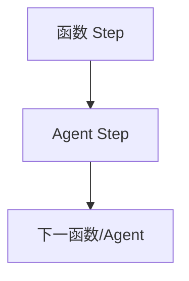

# sequence_with_functions.py — 实现原理分析

> 源文件：`cookbook/04_workflows/01_basic_workflows/01_sequence_of_steps/sequence_with_functions.py`

## 概述

本示例展示 **函数 Step 与 Agent Step 混排**：纯 Python 函数步骤与 Agent/Team 步骤同一 `Workflow` 中顺序执行，支持 sync/async/stream。

## System Prompt 组装

仅 **Agent/Team 步骤** 触发 LLM；函数步骤无 `get_system_message`。

## Mermaid 流程图

```mermaid
flowchart TD
    F["函数 Step"] --> A["Agent Step"]
    A --> F2["下一函数/Agent"]
```

## 关键源码文件索引

| 文件 | 作用 |
|------|------|
| `agno/workflow/step.py` | `Step` 执行器 |
