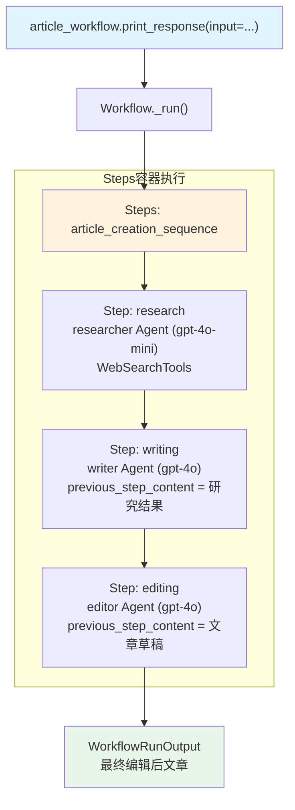

# workflow_using_steps.py — 实现原理分析

> 源文件：`cookbook/04_workflows/01_basic_workflows/01_sequence_of_steps/workflow_using_steps.py`

## 概述

本示例展示 Agno Workflow 的 **`Steps 容器`** 机制：使用 `Steps` 将多个 `Step` 封装为命名序列，再作为一个整体放入 `Workflow.steps`，实现多层次的步骤组织。

**核心配置一览：**

| 配置项 | 值 | 说明 |
|--------|------|------|
| `Workflow.name` | `"Article Creation Workflow"` | 文章创作工作流 |
| `Workflow.steps` | `[article_creation_sequence]` | 仅含一个 Steps 容器 |
| `Steps.name` | `"article_creation"` | 步骤序列名称 |
| `Steps.steps` | `[research_step, writing_step, editing_step]` | 三个顺序步骤 |
| Step 执行者 | `researcher(gpt-4o-mini)`, `writer(gpt-4o)`, `editor(gpt-4o)` | 各步骤的 Agent |

## 架构分层

```
用户代码层                           agno.workflow 层
┌─────────────────────────────┐    ┌────────────────────────────────────────┐
│ workflow_using_steps.py     │    │ Workflow._run()                        │
│                             │    │  └─ Steps._run()                       │
│ article_workflow            │───>│       ├─ Step(research)._run()         │
│   steps=[                   │    │       │   └─ researcher.run()          │
│     article_creation_seq    │    │       ├─ Step(writing)._run()          │
│     (Steps 容器)            │    │       │   └─ writer.run()              │
│   ]                         │    │       └─ Step(editing)._run()          │
│                             │    │           └─ editor.run()              │
└─────────────────────────────┘    └────────────────────────────────────────┘
                                              │
                                              ▼
                                    ┌────────────────────┐
                                    │ OpenAIChat         │
                                    │ gpt-4o-mini / gpt-4o│
                                    └────────────────────┘
```

## 核心组件解析

### Steps 容器

`Steps` 是 `Step` 列表的命名容器，继承了与 `Step` 相同的执行接口：

```python
from agno.workflow.steps import Steps

article_creation_sequence = Steps(
    name="article_creation",
    description="Complete article creation workflow from research to final edit",
    steps=[research_step, writing_step, editing_step],
)

# 作为单个元素放入 Workflow
article_workflow = Workflow(
    name="Article Creation Workflow",
    steps=[article_creation_sequence],  # Steps 容器被当作单步处理
)
```

### Step 封装 Agent

每个 `Step` 封装一个专职 Agent：

```python
research_step = Step(
    name="research",
    agent=researcher,          # gpt-4o-mini + WebSearchTools
    description="Research the topic and gather information",
)

writing_step = Step(
    name="writing",
    agent=writer,              # gpt-4o
    description="Write an article based on the research",
)

editing_step = Step(
    name="editing",
    agent=editor,              # gpt-4o
    description="Edit and polish the article",
)
```

### Steps vs Step 的区别

| 特性 | `Step` | `Steps` |
|------|--------|---------|
| 封装内容 | 单个 Agent/Team/executor | 多个 Step 的有序列表 |
| 用途 | 单一执行单元 | 命名步骤序列组合 |
| 嵌套 | 不可嵌套 Steps | 可嵌套 Step, Condition, Loop, Parallel |
| 输出 | 单个 StepOutput | 最后一步的 StepOutput |

## 执行流

```
Workflow.run("Write an article about renewable energy")
   └─ Steps("article_creation")
        ├─ Step("research") → researcher.run(input) → 研究内容
        ├─ Step("writing")  → writer.run(previous_content) → 文章草稿
        └─ Step("editing")  → editor.run(previous_content) → 精打细磨版
```

## Mermaid 流程图



## 关键源码文件索引

| 文件 | 关键类/函数 | 作用 |
|------|------------|------|
| `agno/workflow/workflow.py` | `Workflow` L1 | 工作流容器 |
| `agno/workflow/steps.py` | `Steps` | 步骤序列容器 |
| `agno/workflow/step.py` | `Step` L59 | 单步执行单元 |
| `agno/workflow/types.py` | `StepInput`, `StepOutput` | 步骤 I/O 数据类型 |
