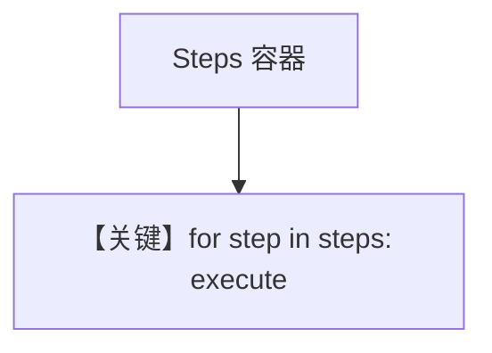

# workflow_using_steps.py — 实现原理分析

> 源文件：`cookbook/04_workflows/01_basic_workflows/01_sequence_of_steps/workflow_using_steps.py`

## 概述

本示例展示 **`Steps` 组合器**：用 `Steps([Step(...), ...])` 封装研究→写作→编辑流水线，复用 `Step` 与 `WebSearchTools` 等。

## 运行机制与因果链

`Steps.execute` 顺序调用子 `step.execute`，输出链式传入 `StepInput`（见 `agno/workflow/steps.py`）。

## System Prompt 组装

各 `Step` 绑定的 Agent 独立 system；Workflow 层无合并 system。

## Mermaid 流程图

```mermaid
flowchart TD
    St["Steps 容器"] --> E["【关键】for step in steps: execute"]
```

## 关键源码文件索引

| 文件 | 作用 |
|------|------|
| `agno/workflow/steps.py` | `Steps` |
