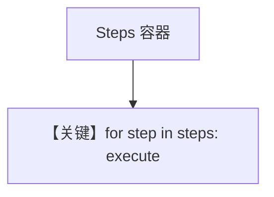

# workflow_using_steps.py — 实现原理分析

<!-- cookbook-py-source:start -->
## 完整源码

```python
"""
Workflow Using Steps
====================

Demonstrates how to compose a workflow from a `Steps` sequence with research, writing, and editing steps.
"""

import asyncio

from agno.agent import Agent
from agno.models.openai import OpenAIChat
from agno.tools.websearch import WebSearchTools
from agno.workflow.step import Step
from agno.workflow.steps import Steps
from agno.workflow.workflow import Workflow

# ---------------------------------------------------------------------------
# Create Agents
# ---------------------------------------------------------------------------
researcher = Agent(
    name="Research Agent",
    model=OpenAIChat(id="gpt-4o-mini"),
    tools=[WebSearchTools()],
    instructions="Research the given topic and provide key facts and insights.",
)

writer = Agent(
    name="Writing Agent",
    model=OpenAIChat(id="gpt-4o"),
    instructions="Write a comprehensive article based on the research provided. Make it engaging and well-structured.",
)

editor = Agent(
    name="Editor Agent",
    model=OpenAIChat(id="gpt-4o"),
    instructions="Review and edit the article for clarity, grammar, and flow. Provide a polished final version.",
)

# ---------------------------------------------------------------------------
# Define Steps
# ---------------------------------------------------------------------------
research_step = Step(
    name="research",
    agent=researcher,
    description="Research the topic and gather information",
)

writing_step = Step(
    name="writing",
    agent=writer,
    description="Write an article based on the research",
)

editing_step = Step(
    name="editing",
    agent=editor,
    description="Edit and polish the article",
)

article_creation_sequence = Steps(
    name="article_creation",
    description="Complete article creation workflow from research to final edit",
    steps=[research_step, writing_step, editing_step],
)

# ---------------------------------------------------------------------------
# Create Workflow
# ---------------------------------------------------------------------------
article_workflow = Workflow(
    name="Article Creation Workflow",
    description="Automated article creation from research to publication",
    steps=[article_creation_sequence],
)

# ---------------------------------------------------------------------------
# Run Workflow
# ---------------------------------------------------------------------------
if __name__ == "__main__":
    # Sync
    article_workflow.print_response(
        input="Write an article about the benefits of renewable energy",
        markdown=True,
    )

    # Async
    asyncio.run(
        article_workflow.aprint_response(
            input="Write an article about the benefits of renewable energy",
            markdown=True,
        )
    )
```

<!-- cookbook-py-source:end -->

> 源文件：`cookbook/04_workflows/01_basic_workflows/01_sequence_of_steps/workflow_using_steps.py`

## 概述

本示例展示 **`Steps` 组合器**：用 `Steps([Step(...), ...])` 封装研究→写作→编辑流水线，复用 `Step` 与 `WebSearchTools` 等。

## 运行机制与因果链

`Steps.execute` 顺序调用子 `step.execute`，输出链式传入 `StepInput`（见 `agno/workflow/steps.py`）。

## System Prompt 组装

各 `Step` 绑定的 Agent 独立 system；Workflow 层无合并 system。

## Mermaid 流程图


```mermaid
flowchart TD
    St["Steps 容器"] --> E["【关键】for step in steps: execute"]
```

## 关键源码文件索引

| 文件 | 作用 |
|------|------|
| `agno/workflow/steps.py` | `Steps` |
