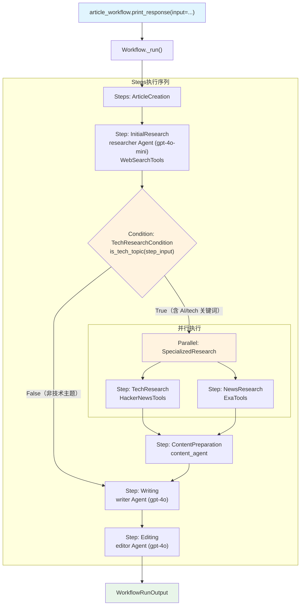

# workflow_using_steps_nested.py — 实现原理分析

> 源文件：`cookbook/04_workflows/01_basic_workflows/01_sequence_of_steps/workflow_using_steps_nested.py`

## 概述

本示例展示 Agno Workflow 的 **`嵌套步骤组合`** 机制：在 `Steps` 容器内嵌套 `Condition` 和 `Parallel`，将条件分支和并行执行组合为复杂的多层次工作流结构。

**核心配置一览：**

| 配置项 | 值 | 说明 |
|--------|------|------|
| `Workflow.name` | `"Enhanced Article Creation Workflow"` | 增强型文章创作 |
| `Workflow.steps` | `[article_creation_sequence]` | 单个 Steps 容器 |
| `Steps` 内结构 | `[initial_research, Condition([Parallel(...),...]), writing, editing]` | 嵌套组合 |
| `Condition.evaluator` | `is_tech_topic` | 关键词检测函数 |
| `Parallel` 内容 | `(tech_research_step, news_research_step)` | 两个步骤并行 |

## 架构分层

```
用户代码层                           agno.workflow 层
┌──────────────────────────┐    ┌────────────────────────────────────────────┐
│ workflow_using_steps_     │    │ Workflow._run()                            │
│ nested.py                │    │  └─ Steps._run()                           │
│                          │    │       ├─ Step(InitialResearch)._run()      │
│ article_workflow         │───>│       ├─ Condition(TechResearchCondition)  │
│   steps=[                │    │       │   ├─ evaluator(is_tech_topic) → T/F│
│     Steps([              │    │       │   └─ if True:                      │
│       initial_research,  │    │       │       Parallel(tech, news)._run()  │
│       Condition([        │    │       │       content_prep._run()          │
│         Parallel(t,n),   │    │       ├─ Step(Writing)._run()             │
│         content_prep,    │    │       └─ Step(Editing)._run()             │
│       ]),                │    └────────────────────────────────────────────┘
│       writing, editing,  │
│     ])                   │
│   ]                      │
└──────────────────────────┘
```

## 核心组件解析

### 嵌套结构组合

```python
article_creation_sequence = Steps(
    name="ArticleCreation",
    steps=[
        initial_research_step,                    # 普通步骤
        Condition(
            name="TechResearchCondition",
            evaluator=is_tech_topic,              # 布尔评估函数
            steps=[
                Parallel(                         # 并行执行
                    tech_research_step,
                    news_research_step,
                    name="SpecializedResearch",
                ),
                content_prep_step,               # 串行继续
            ],
        ),
        writing_step,                            # 始终执行
        editing_step,                            # 始终执行
    ],
)
```

### Condition 评估器

```python
def is_tech_topic(step_input) -> bool:
    message = step_input.input.lower() if step_input.input else ""
    tech_keywords = ["ai", "machine learning", "technology", "software", ...]
    return any(keyword in message for keyword in tech_keywords)
```

当 `evaluator` 返回 `True` 时，执行 `steps`（Parallel + content_prep）；返回 `False` 时跳过整个 Condition 块。

### Parallel 并行执行

`Parallel` 使用多线程并发执行其中的步骤：

```python
Parallel(
    tech_research_step,    # HackerNews Agent
    news_research_step,    # Exa Agent
    name="SpecializedResearch",
)
```

并行结果通过 `StepOutput.steps` 列表传递给后续步骤，后续步骤可通过 `step_input.previous_step_outputs` 访问各并行步骤的结果。

## 执行路径

**技术主题（`is_tech_topic` = True）：**

```
initial_research → Condition=True → Parallel(tech+news) → content_prep → writing → editing
```

**非技术主题（`is_tech_topic` = False）：**

```
initial_research → Condition=False (跳过) → writing → editing
```

## Mermaid 流程图



## 关键源码文件索引

| 文件 | 关键类/函数 | 作用 |
|------|------------|------|
| `agno/workflow/steps.py` | `Steps` | 步骤序列容器 |
| `agno/workflow/condition.py` | `Condition` L42 | 条件分支执行 |
| `agno/workflow/parallel.py` | `Parallel` L43 | 并行执行多个步骤 |
| `agno/workflow/step.py` | `Step` L59 | 单步执行单元 |
