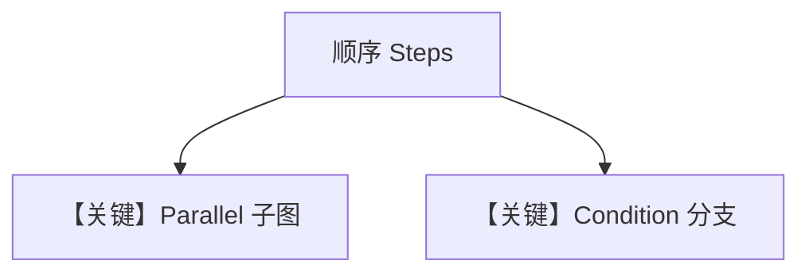

# workflow_using_steps_nested.py — 实现原理分析

> 源文件：`cookbook/04_workflows/01_basic_workflows/01_sequence_of_steps/workflow_using_steps_nested.py`

## 概述

本示例展示 **嵌套 `Steps` + `Condition` + `Parallel`**：在顺序流中插入条件分支与并行块，形成 DAG 子结构。

## 运行机制与因果链

`Condition`/`Parallel` 的 `execute` 可返回 `List[StepOutput]`，`Steps.execute` 聚合（见 `steps.py` L267-274）。

## Mermaid 流程图

```mermaid
flowchart TD
    Seq["顺序 Steps"] --> P["【关键】Parallel 子图"]
    Seq --> C["【关键】Condition 分支"]
```

## 关键源码文件索引

| 文件 | 作用 |
|------|------|
| `agno/workflow/parallel.py` | `Parallel` |
| `agno/workflow/condition.py` | `Condition` |
