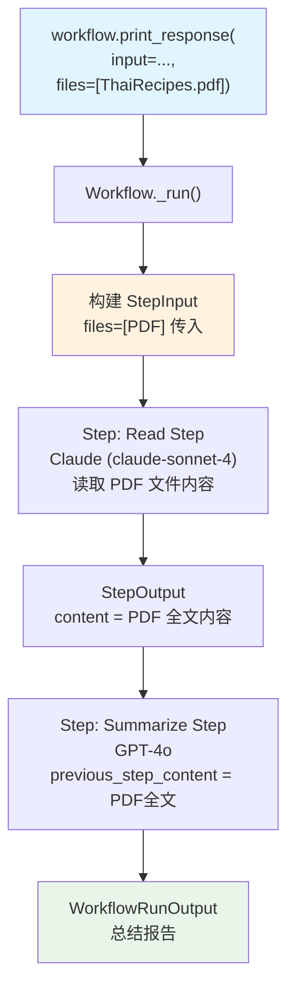

# workflow_with_file_input.py — 实现原理分析

> 源文件：`cookbook/04_workflows/01_basic_workflows/01_sequence_of_steps/workflow_with_file_input.py`

## 概述

本示例展示 Agno Workflow 的 **`文件输入传递`** 机制：通过 `Workflow.print_response(files=[...])` 将文件对象传入工作流，文件随 `StepInput` 在步骤间传递，每个步骤的 Agent 均可读取原始文件。

**核心配置一览：**

| 配置项 | 值 | 说明 |
|--------|------|------|
| `Workflow.name` | `"Content Creation Workflow"` | 内容创作工作流 |
| `Workflow.steps` | `[read_step, summarize_step]` | 两步顺序执行 |
| Step 1 执行者 | `Claude(id="claude-sonnet-4-20250514")` | 读取文件内容 |
| Step 2 执行者 | `OpenAIChat(id="gpt-4o")` | 总结文件内容 |
| 文件输入 | `File(url="https://...ThaiRecipes.pdf")` | URL 引用的 PDF 文件 |

## 架构分层

```
用户代码层                           agno.workflow 层
┌─────────────────────────────┐    ┌────────────────────────────────────────┐
│ workflow_with_file_input.py │    │ Workflow._run()                        │
│                             │    │  ├─ files=[File(url=...)]              │
│ content_creation_workflow   │───>│  │   → StepInput.files 传递           │
│   steps=[read_step,         │    │  ├─ Step(read)._run()                  │
│          summarize_step]    │    │  │   └─ Claude.run(input, files=files)  │
│                             │    │  └─ Step(summarize)._run()              │
│ workflow.print_response(    │    │      └─ GPT-4o.run(previous_content)    │
│   files=[File(url=...)]     │    └────────────────────────────────────────┘
│ )                           │
└─────────────────────────────┘
                                    ┌─────────────────┐  ┌─────────────────┐
                                    │ Claude          │  │ OpenAIChat      │
                                    │ claude-sonnet-4 │  │ gpt-4o          │
                                    └─────────────────┘  └─────────────────┘
```

## 核心组件解析

### 文件输入传递

文件通过 `Workflow.print_response(files=[...])` 传入，Workflow 将文件打包至每个步骤的 `StepInput.files`：

```python
content_creation_workflow.print_response(
    input="Summarize the contents of the attached file.",
    files=[
        File(url="https://agno-public.s3.amazonaws.com/recipes/ThaiRecipes.pdf")
    ],
    markdown=True,
)
```

### Step 与 Agent 的文件处理

Claude 和 GPT-4o 均支持多模态输入，文件随步骤输入自动传递：

```python
read_agent = Agent(
    name="Agent",
    model=Claude(id="claude-sonnet-4-20250514"),  # Claude 支持文件/PDF 读取
    role="Read the contents of the attached file.",
)

summarize_agent = Agent(
    name="Summarize Agent",
    model=OpenAIChat(id="gpt-4o"),
    instructions=["Summarize the contents of the attached file."],
)
```

### StepInput.files

| 字段 | 类型 | 说明 |
|------|------|------|
| `StepInput.files` | `Optional[List[File]]` | 文件列表，从 Workflow 层透传 |
| `StepInput.images` | `Optional[List[Image]]` | 图片输入（同理传递） |
| `StepInput.videos` | `Optional[List[Video]]` | 视频输入（同理传递） |
| `StepInput.audio` | `Optional[List[Audio]]` | 音频输入（同理传递） |

## 执行流

```
workflow.print_response(input="Summarize...", files=[PDF_FILE])
  │
  ├─ StepInput(input="Summarize...", files=[PDF_FILE])
  │    └─ Step(read_step) → Claude reads PDF → "Thai recipe content..."
  │
  └─ StepInput(input="Summarize...", previous_step_content="Thai recipe content...", files=[PDF_FILE])
       └─ Step(summarize_step) → GPT-4o summarizes → final summary
```

## Mermaid 流程图



## 关键源码文件索引

| 文件 | 关键类/函数 | 作用 |
|------|------------|------|
| `agno/workflow/types.py` | `StepInput.files` L113 | 文件列表传递字段 |
| `agno/media/__init__.py` | `File` | 文件媒体类型封装 |
| `agno/workflow/step.py` | `Step._run()` | 将文件传递给 Agent/Team |
