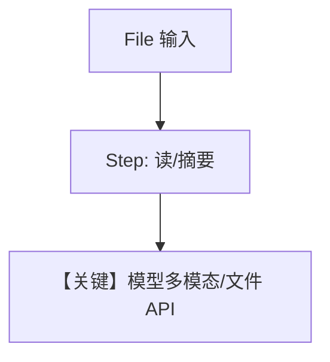

# workflow_with_file_input.py — 实现原理分析

<!-- cookbook-py-source:start -->
## 完整源码

```python
"""
Workflow With File Input
========================

Demonstrates passing file inputs through workflow steps for reading and summarization.
"""

from agno.agent import Agent
from agno.db.sqlite import SqliteDb
from agno.media import File
from agno.models.anthropic import Claude
from agno.models.openai import OpenAIChat
from agno.workflow.step import Step
from agno.workflow.workflow import Workflow

# ---------------------------------------------------------------------------
# Create Agents
# ---------------------------------------------------------------------------
read_agent = Agent(
    name="Agent",
    model=Claude(id="claude-sonnet-4-20250514"),
    role="Read the contents of the attached file.",
)

summarize_agent = Agent(
    name="Summarize Agent",
    model=OpenAIChat(id="gpt-4o"),
    instructions=[
        "Summarize the contents of the attached file.",
    ],
)

# ---------------------------------------------------------------------------
# Define Steps
# ---------------------------------------------------------------------------
read_step = Step(
    name="Read Step",
    agent=read_agent,
)

summarize_step = Step(
    name="Summarize Step",
    agent=summarize_agent,
)

# ---------------------------------------------------------------------------
# Create Workflow
# ---------------------------------------------------------------------------
content_creation_workflow = Workflow(
    name="Content Creation Workflow",
    description="Automated content creation from blog posts to social media",
    db=SqliteDb(
        session_table="workflow",
        db_file="tmp/workflow.db",
    ),
    steps=[read_step, summarize_step],
)

# ---------------------------------------------------------------------------
# Run Workflow
# ---------------------------------------------------------------------------
if __name__ == "__main__":
    content_creation_workflow.print_response(
        input="Summarize the contents of the attached file.",
        files=[
            File(url="https://agno-public.s3.amazonaws.com/recipes/ThaiRecipes.pdf")
        ],
        markdown=True,
    )
```

<!-- cookbook-py-source:end -->

> 源文件：`cookbook/04_workflows/01_basic_workflows/01_sequence_of_steps/workflow_with_file_input.py`

## 概述

本示例展示 **工作流级 `File` 输入**：通过 `Workflow.run(..., files=[...])` 或步骤输入把文件传至读摘要类 Agent；可混用 **Claude** 与 **OpenAIChat**（以 `.py` 为准）。

## System Prompt 组装

带文件时 Agent 的 user/system 侧会含附件说明（见 `agno/agent/_messages.py` 媒体段）。

## Mermaid 流程图


```mermaid
flowchart TD
    File["File 输入"] --> St["Step: 读/摘要"]
    St --> M["【关键】模型多模态/文件 API"]
```

## 关键源码文件索引

| 文件 | 作用 |
|------|------|
| `agno/workflow/workflow.py` | `run(..., files=)` |
