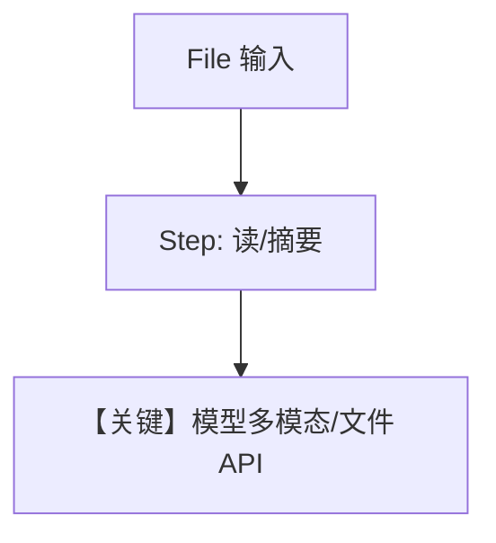

# workflow_with_file_input.py — 实现原理分析

> 源文件：`cookbook/04_workflows/01_basic_workflows/01_sequence_of_steps/workflow_with_file_input.py`

## 概述

本示例展示 **工作流级 `File` 输入**：通过 `Workflow.run(..., files=[...])` 或步骤输入把文件传至读摘要类 Agent；可混用 **Claude** 与 **OpenAIChat**（以 `.py` 为准）。

## System Prompt 组装

带文件时 Agent 的 user/system 侧会含附件说明（见 `agno/agent/_messages.py` 媒体段）。

## Mermaid 流程图

```mermaid
flowchart TD
    File["File 输入"] --> St["Step: 读/摘要"]
    St --> M["【关键】模型多模态/文件 API"]
```

## 关键源码文件索引

| 文件 | 作用 |
|------|------|
| `agno/workflow/workflow.py` | `run(..., files=)` |
