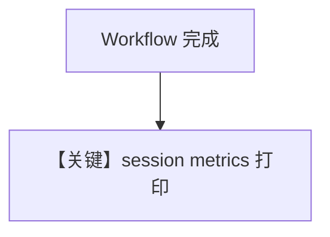

# workflow_with_session_metrics.py — 实现原理分析

> 源文件：`cookbook/04_workflows/01_basic_workflows/01_sequence_of_steps/workflow_with_session_metrics.py`

## 概述

本示例展示 **Workflow 执行结束后读取 session 级 metrics**（`pprint_run_response` 等），常配合 `SqliteDb`；含 **Team** 作为步骤时累积团队与子 Agent 调用成本。

## System Prompt 组装

Workflow 无单一 system；metrics 非 prompt 内容。

## Mermaid 流程图

## 关键源码文件索引

| 文件 | 作用 |
|------|------|
| `agno/workflow/workflow.py` | `WorkflowMetrics` |
