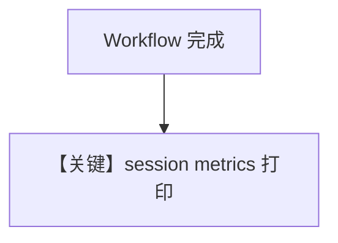

# workflow_with_session_metrics.py — 实现原理分析

<!-- cookbook-py-source:start -->
## 完整源码

```python
"""
Workflow With Session Metrics
=============================

Demonstrates collecting and printing workflow session metrics after execution.
"""

from agno.agent import Agent
from agno.db.sqlite import SqliteDb
from agno.models.openai import OpenAIChat
from agno.team import Team
from agno.tools.hackernews import HackerNewsTools
from agno.tools.websearch import WebSearchTools
from agno.utils.pprint import pprint_run_response
from agno.workflow.step import Step
from agno.workflow.workflow import Workflow
from rich.pretty import pprint

# ---------------------------------------------------------------------------
# Create Agents
# ---------------------------------------------------------------------------
hackernews_agent = Agent(
    name="Hackernews Agent",
    model=OpenAIChat(id="gpt-4o-mini"),
    tools=[HackerNewsTools()],
    role="Extract key insights and content from Hackernews posts",
)

web_agent = Agent(
    name="Web Agent",
    model=OpenAIChat(id="gpt-4o-mini"),
    tools=[WebSearchTools()],
    role="Search the web for the latest news and trends",
)

content_planner = Agent(
    name="Content Planner",
    model=OpenAIChat(id="gpt-4o"),
    instructions=[
        "Plan a content schedule over 4 weeks for the provided topic and research content",
        "Ensure that I have posts for 3 posts per week",
    ],
)

# ---------------------------------------------------------------------------
# Create Team
# ---------------------------------------------------------------------------
research_team = Team(
    name="Research Team",
    members=[hackernews_agent, web_agent],
    instructions="Research tech topics from Hackernews and the web",
)

# ---------------------------------------------------------------------------
# Define Steps
# ---------------------------------------------------------------------------
research_step = Step(
    name="Research Step",
    team=research_team,
)

content_planning_step = Step(
    name="Content Planning Step",
    agent=content_planner,
)

# ---------------------------------------------------------------------------
# Create Workflow
# ---------------------------------------------------------------------------
content_creation_workflow = Workflow(
    name="Content Creation Workflow",
    description="Automated content creation from blog posts to social media",
    db=SqliteDb(
        session_table="workflow_session",
        db_file="tmp/workflow_session_metrics.db",
    ),
    steps=[research_step, content_planning_step],
)

# ---------------------------------------------------------------------------
# Run Workflow
# ---------------------------------------------------------------------------
if __name__ == "__main__":
    response = content_creation_workflow.run(
        input="AI trends in 2024",
    )

    print("=" * 50)
    print("WORKFLOW RESPONSE")
    print("=" * 50)
    pprint_run_response(response, markdown=True)

    print("\n" + "=" * 50)
    print("SESSION METRICS")
    print("=" * 50)

    session_metrics = content_creation_workflow.get_session_metrics()
    pprint(session_metrics)
```

<!-- cookbook-py-source:end -->

> 源文件：`cookbook/04_workflows/01_basic_workflows/01_sequence_of_steps/workflow_with_session_metrics.py`

## 概述

本示例展示 **Workflow 执行结束后读取 session 级 metrics**（`pprint_run_response` 等），常配合 `SqliteDb`；含 **Team** 作为步骤时累积团队与子 Agent 调用成本。

## System Prompt 组装

Workflow 无单一 system；metrics 非 prompt 内容。

## Mermaid 流程图



## 关键源码文件索引

| 文件 | 作用 |
|------|------|
| `agno/workflow/workflow.py` | `WorkflowMetrics` |
