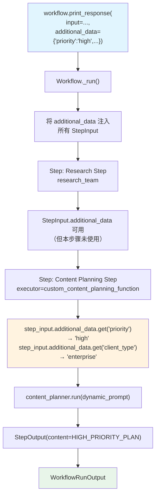

# step_with_additional_data.py — 实现原理分析

> 源文件：`cookbook/04_workflows/01_basic_workflows/02_step_with_function/step_with_additional_data.py`

## 概述

本示例展示 Agno Workflow 的 **`additional_data 运行时附加数据`** 机制：通过 `workflow.print_response(additional_data={...})` 传入键值对，步骤执行器通过 `step_input.additional_data` 读取这些运行时参数，实现动态配置而无需修改 Agent 或步骤定义。

**核心配置一览：**

| 配置项 | 值 | 说明 |
|--------|------|------|
| `additional_data` | `{"user_email": ..., "priority": ..., "client_type": ...}` | 运行时附加数据 |
| `StepInput.additional_data` | `Dict[str, Any]` | 读取附加数据的字段 |
| 执行器签名（同步） | `(StepInput) -> StepOutput` | 访问 additional_data |
| 执行器签名（异步） | `(StepInput) -> AsyncIterator[...]` | 异步版本 |

## 架构分层

```
用户代码层                              agno.workflow 层
┌──────────────────────────────────┐  ┌────────────────────────────────────────┐
│ step_with_additional_data.py    │  │ Workflow._run()                        │
│                                  │  │  ├─ 将 additional_data 注入 StepInput │
│ workflow.print_response(         │  │  ├─ Step(research_step)._run()        │
│   input="AI trends in 2024",    │──>│  └─ Step(content_planning)._run()    │
│   additional_data={              │  │      └─ executor(step_input)          │
│     "user_email": "k@agno.com", │  │          step_input.additional_data   │
│     "priority": "high",          │  │          → 读取运行时参数             │
│     "client_type": "enterprise", │  └────────────────────────────────────────┘
│   },                             │
│ )                                │
└──────────────────────────────────┘
```

## 核心组件解析

### additional_data 读取

```python
def custom_content_planning_function(step_input: StepInput) -> StepOutput:
    message = step_input.input
    previous_step_content = step_input.previous_step_content

    # 从 additional_data 读取运行时参数
    additional_data = step_input.additional_data or {}
    user_email = additional_data.get("user_email", "No email provided")
    priority = additional_data.get("priority", "normal")
    client_type = additional_data.get("client_type", "standard")

    # 基于 additional_data 动态构建 prompt
    planning_prompt = f"""
        Topic: {message}
        Client: {client_type}  Priority: {priority}
        {"6. Mark as HIGH PRIORITY delivery" if priority == "high" else "6. Standard delivery"}
    """
    response = content_planner.run(planning_prompt)
    return StepOutput(content=f"[{priority.upper()}] {response.content}")
```

### 传递方式

```python
# 同步
content_creation_workflow.print_response(
    input="AI trends in 2024",
    additional_data={
        "user_email": "kaustubh@agno.com",
        "priority": "high",
        "client_type": "enterprise",
    },
    stream=True,
)

# 异步
asyncio.run(
    async_content_creation_workflow.aprint_response(
        input="AI trends in 2024",
        additional_data={...},
        stream=True,
    )
)
```

### additional_data 生命周期

`additional_data` 从 `Workflow.run()` 调用处传入，注入到所有步骤的 `StepInput` 中：

```
Workflow.run(input=..., additional_data={...})
  → 所有 Step 的 StepInput.additional_data = {user_email, priority, client_type}
  → 每个 executor/agent/team 都可通过 step_input.additional_data 读取
```

与 `session_state` 的区别：

| 特性 | `additional_data` | `session_state` |
|------|------------------|----------------|
| 来源 | 每次运行时传入 | 跨运行持久化 |
| 持久化 | 不持久 | 数据库持久化 |
| 修改 | 只读（步骤不应修改） | 步骤可修改 |
| 用途 | 运行时配置参数 | 跨步骤共享状态 |

## Mermaid 流程图



## 关键源码文件索引

| 文件 | 关键类/函数 | 作用 |
|------|------------|------|
| `agno/workflow/types.py` | `StepInput.additional_data` L107 | 附加数据字段 |
| `agno/workflow/types.py` | `WorkflowExecutionInput.additional_data` L53 | 工作流执行输入携带 additional_data |
| `agno/workflow/step.py` | `Step._run()` | 将 additional_data 注入 StepInput |
