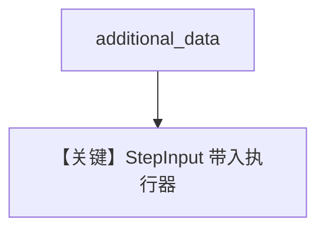

# step_with_additional_data.py — 实现原理分析

> 源文件：`cookbook/04_workflows/01_basic_workflows/02_step_with_function/step_with_additional_data.py`

## 概述

本示例展示 **自定义 Step 执行器消费 `additional_data`**：`Workflow.run(additional_data={...})` 经 `RunContext` / `StepInput` 传入同步与异步函数步骤。

## 运行机制与因果链

函数步骤可纯本地逻辑，无 LLM；`additional_data` 用于配置型参数或与 `session_state` 组合。

## Mermaid 流程图

```mermaid
flowchart TD
    A["additional_data"] --> X["【关键】StepInput 带入执行器"]
```

## 关键源码文件索引

| 文件 | 作用 |
|------|------|
| `agno/workflow/types.py` | `StepInput` |
