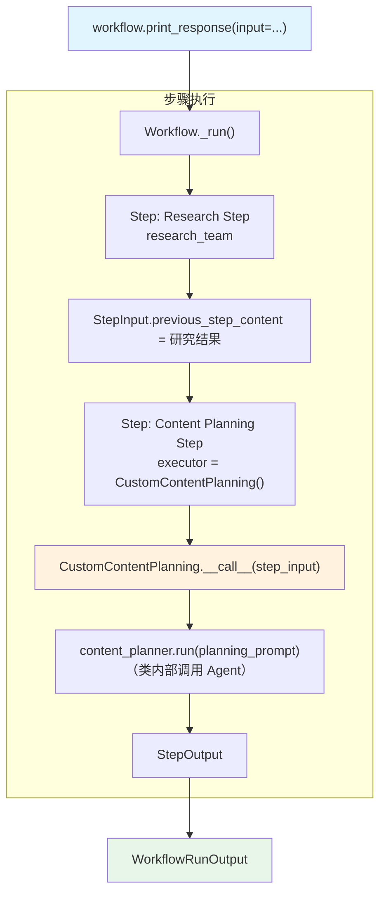

# step_with_class.py — 实现原理分析

> 源文件：`cookbook/04_workflows/01_basic_workflows/02_step_with_function/step_with_class.py`

## 概述

本示例展示 Agno Workflow 的 **`类可调用体（Callable Class）执行器`** 机制：通过实现 `__call__` 方法的类实例作为 `Step.executor`，使执行器可以携带状态、依赖注入和面向对象设计，等价于函数执行器但更具扩展性。

**核心配置一览：**

| 配置项 | 值 | 说明 |
|--------|------|------|
| `Step.executor` | `CustomContentPlanning()` | 类实例作为执行器 |
| 同步类 | `CustomContentPlanning.__call__(StepInput) -> StepOutput` | 同步可调用类 |
| 异步类 | `AsyncCustomContentPlanning.__call__(StepInput) -> AsyncIterator[...]` | 异步可调用类 |
| 执行器内部 Agent | `content_planner` / `streaming_content_planner` | 类封装的 Agent 调用 |

## 架构分层

```
用户代码层                              agno.workflow 层
┌──────────────────────────────────┐  ┌────────────────────────────────────────┐
│ step_with_class.py              │  │ Workflow._run()                        │
│                                  │  │  ├─ Step(research)._run()             │
│ content_planning_step = Step(   │  │  │   └─ research_team.run()            │
│   executor=CustomContentPlanning│──>│  └─ Step(content_planning)._run()    │
│   ()   ← 类实例                 │  │      └─ executor.__call__(step_input) │
│ )                                │  │          └─ content_planner.run()    │
└──────────────────────────────────┘  └────────────────────────────────────────┘
```

## 核心组件解析

### 同步可调用类

```python
class CustomContentPlanning:
    def __call__(self, step_input: StepInput) -> StepOutput:
        # 与函数执行器完全相同的逻辑
        message = step_input.input
        previous_step_content = step_input.previous_step_content
        response = content_planner.run(planning_prompt)
        return StepOutput(content=enhanced_content)
```

### 异步可调用类

```python
class AsyncCustomContentPlanning:
    async def __call__(
        self,
        step_input: StepInput,
    ) -> AsyncIterator[Union[WorkflowRunOutputEvent, StepOutput]]:
        # 异步流式：先透传事件，再产出最终结果
        async for event in streaming_content_planner.arun(..., stream_events=True):
            yield event
        response = streaming_content_planner.get_last_run_output()
        yield StepOutput(content=f"...{response.content}...")
```

### Step 使用类实例

```python
content_planning_step = Step(
    name="Content Planning Step",
    executor=CustomContentPlanning(),     # 类实例（同步）
)

async_content_planning_step = Step(
    name="Content Planning Step",
    executor=AsyncCustomContentPlanning(),  # 类实例（异步）
)
```

### 类执行器 vs 函数执行器

| 特性 | 函数执行器 | 类执行器 |
|------|-----------|---------|
| 定义方式 | `def fn(step_input)` | `class Executor: def __call__(self, step_input)` |
| 状态携带 | 通过闭包或全局变量 | 通过实例属性 |
| 依赖注入 | 闭包捕获 | 构造函数注入 |
| 签名兼容性 | 完全兼容 | 完全兼容（Workflow 检测 callable） |
| 可测试性 | 较低 | 较高（可 mock 实例属性） |

## Mermaid 流程图



## 关键源码文件索引

| 文件 | 关键类/函数 | 作用 |
|------|------------|------|
| `agno/workflow/step.py` | `StepExecutor` L44 | executor 类型别名（接受 callable） |
| `agno/workflow/step.py` | `Step.executor` L67 | executor 字段（支持函数或可调用对象） |
| `agno/workflow/types.py` | `StepInput`, `StepOutput` | I/O 数据类型 |
