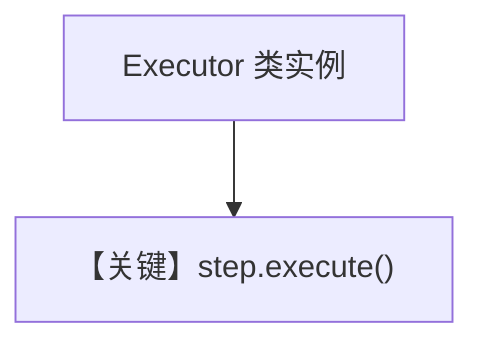

# step_with_class.py — 实现原理分析

> 源文件：`cookbook/04_workflows/01_basic_workflows/02_step_with_function/step_with_class.py`

## 概述

本示例展示 **类-based Step 执行器**（实现特定 `execute` 协议），可在实例上保存配置，支持 sync/async 与流式事件。

## System Prompt 组装

若类执行器内部调用 Agent，则仍走 Agent `get_system_message`。

## Mermaid 流程图

```mermaid
flowchart TD
    C["Executor 类实例"] --> E["【关键】step.execute()"]
```

## 关键源码文件索引

| 文件 | 作用 |
|------|------|
| `agno/workflow/step.py` | `Step` |
