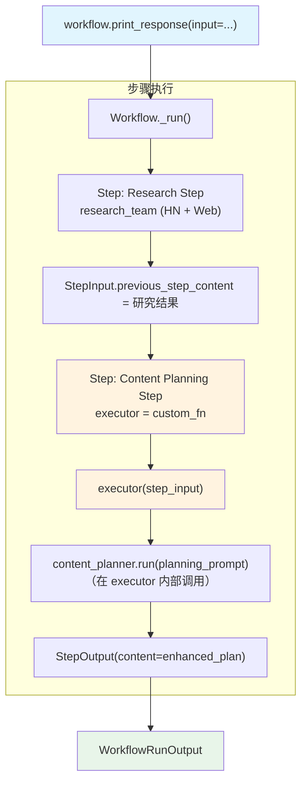

# step_with_function.py — 实现原理分析

> 源文件：`cookbook/04_workflows/01_basic_workflows/02_step_with_function/step_with_function.py`

## 概述

本示例展示 Agno Workflow 的 **`Step.executor 自定义执行器`** 机制：通过 `Step(executor=custom_fn)` 将自定义函数作为步骤执行器，执行器可以在内部调用 Agent/Team，并支持同步、同步流式、异步流式三种模式。

**核心配置一览：**

| 配置项 | 值 | 说明 |
|--------|------|------|
| `Step.executor` | `custom_content_planning_function` | 自定义函数执行器 |
| 执行器签名（同步） | `(StepInput) -> StepOutput` | 返回单个输出 |
| 执行器签名（同步流式） | `(StepInput) -> Iterator[WorkflowRunOutputEvent \| StepOutput]` | 产出事件流 |
| 执行器签名（异步流式） | `(StepInput) -> AsyncIterator[WorkflowRunOutputEvent \| StepOutput]` | 异步事件流 |
| 内部 Agent | `content_planner` / `streaming_content_planner` | executor 内部调用 |

## 架构分层

```
用户代码层                             agno.workflow 层
┌───────────────────────────────┐    ┌────────────────────────────────────────┐
│ step_with_function.py        │    │ Workflow._run()                        │
│                               │    │  ├─ Step(research)._run()             │
│ content_creation_workflow    │───>│  │   └─ research_team.run()            │
│   steps=[                     │    │  └─ Step(content_planning)._run()     │
│     research_step(team),      │    │      └─ executor(step_input)          │
│     content_planning_step     │    │          └─ content_planner.run()     │
│     (executor=custom_fn)      │    └────────────────────────────────────────┘
│   ]                           │
└───────────────────────────────┘
                                      ┌────────────────────┐
                                      │ OpenAIChat gpt-4o  │
                                      └────────────────────┘
```

## 核心组件解析

### 同步执行器

```python
def custom_content_planning_function(step_input: StepInput) -> StepOutput:
    message = step_input.input
    previous_step_content = step_input.previous_step_content  # 来自 research_team

    planning_prompt = f"Topic: {message}\nResearch: {previous_step_content[:500]}"
    response = content_planner.run(planning_prompt)  # 在 executor 内部调用 Agent

    enhanced_content = f"## Strategic Content Plan\n{response.content}"
    return StepOutput(content=enhanced_content)
```

### 同步流式执行器

```python
def custom_content_planning_function_stream(
    step_input: StepInput,
) -> Iterator[Union[WorkflowRunOutputEvent, StepOutput]]:
    # 1. 先透传 Agent 的事件流
    response_iterator = streaming_content_planner.run(
        planning_prompt, stream=True, stream_events=True
    )
    for event in response_iterator:
        yield event  # 透传 Agent 事件到 Workflow 层

    # 2. 获取完整结果后，产出最终 StepOutput
    response = streaming_content_planner.get_last_run_output()
    yield StepOutput(content=f"...{response.content}...")
```

### 异步流式执行器

```python
async def custom_content_planning_function_async_stream(
    step_input: StepInput,
) -> AsyncIterator[Union[WorkflowRunOutputEvent, StepOutput]]:
    async for event in streaming_content_planner.arun(..., stream_events=True):
        yield event
    response = streaming_content_planner.get_last_run_output()
    yield StepOutput(content=...)
```

### Step.executor 配置

```python
content_planning_step = Step(
    name="Content Planning Step",
    executor=custom_content_planning_function,   # 同步版
)

streaming_content_planning_step = Step(
    name="Content Planning Step",
    executor=custom_content_planning_function_stream,   # 同步流式版
)
```

## 执行器签名对比

| 模式 | 签名 | 适用场景 |
|------|------|---------|
| 同步返回 | `(StepInput) -> StepOutput` | 简单场景 |
| 同步流式 | `(StepInput) -> Iterator[Union[Event, StepOutput]]` | 需要实时流式输出 |
| 异步流式 | `(StepInput) -> AsyncIterator[Union[Event, StepOutput]]` | 生产异步环境 |

## Mermaid 流程图



## 关键源码文件索引

| 文件 | 关键类/函数 | 作用 |
|------|------------|------|
| `agno/workflow/step.py` | `Step.executor` L67 | executor 字段定义 |
| `agno/workflow/step.py` | `StepExecutor` L44 | executor 类型别名 |
| `agno/workflow/types.py` | `StepInput`, `StepOutput` | I/O 数据类型 |
| `agno/run/workflow.py` | `WorkflowRunOutputEvent` | 工作流事件类型 |
