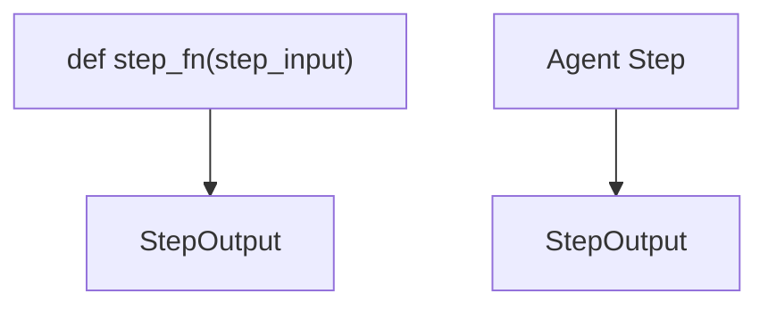

# step_with_function.py — 实现原理分析

> 源文件：`cookbook/04_workflows/01_basic_workflows/02_step_with_function/step_with_function.py`

## 概述

本示例展示 **函数作为 Step 执行体**：支持同步、同步流式、异步流式；与 `Agent` 步骤混排在同一 `Workflow`。

## Mermaid 流程图

```mermaid
flowchart TD
    Fn["def step_fn(step_input)"] --> O["StepOutput"]
    Ag["Agent Step"] --> O2["StepOutput"]
```

## 关键源码文件索引

| 文件 | 作用 |
|------|------|
| `agno/workflow/step.py` | 函数包装为 `Step` |
