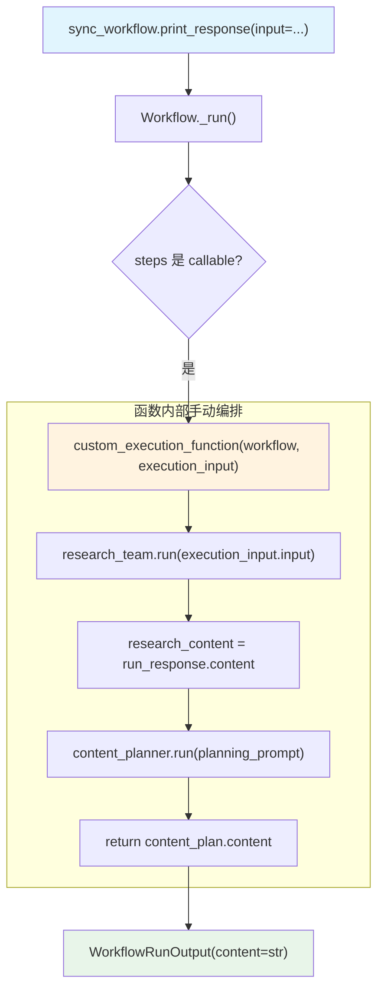

# function_workflow.py — 实现原理分析

> 源文件：`cookbook/04_workflows/01_basic_workflows/03_function_workflows/function_workflow.py`

## 概述

本示例展示 Agno Workflow 的 **`函数式工作流`** 机制：`Workflow.steps` 直接接受单个函数（而非列表），该函数接收 `(workflow, execution_input)` 两个参数，拥有完全的程序控制权，在函数内部手动编排 Agent/Team 调用序列。

**核心配置一览：**

| 配置项 | 值 | 说明 |
|--------|------|------|
| `Workflow.steps` | `custom_execution_function` | 单个函数（非列表） |
| 函数签名 | `(Workflow, WorkflowExecutionInput) -> str` | 工作流级函数 |
| 函数签名（流式） | `(Workflow, WorkflowExecutionInput) -> Iterator` | 返回迭代器 |
| 函数签名（异步） | `(Workflow, WorkflowExecutionInput) -> Awaitable[str]` | 异步版本 |
| `WorkflowExecutionInput` | `.input` 字段 | 包含原始用户输入 |

## 架构分层

```
用户代码层                              agno.workflow 层
┌──────────────────────────────────┐  ┌────────────────────────────────────────┐
│ function_workflow.py            │  │ Workflow._run()                        │
│                                  │  │  └─ 检测 steps 是 callable            │
│ sync_workflow = Workflow(        │  │      └─ custom_execution_function(     │
│   steps=custom_execution_function│──>│          workflow=self,               │
│ )                                │  │          execution_input=input        │
│                                  │  │        )                              │
│ workflow.print_response(input=..)│  └────────────────────────────────────────┘
└──────────────────────────────────┘
                                      ┌────────────────────┐
                                      │ OpenAIChat         │
                                      │ gpt-4o / gpt-5.2   │
                                      └────────────────────┘
```

## 核心组件解析

### 函数式工作流函数签名

函数接受 `workflow` 对象和 `execution_input` 对象，而非 `StepInput`：

```python
def custom_execution_function(
    workflow: Workflow,
    execution_input: WorkflowExecutionInput,
) -> str:
    print(f"Executing workflow: {workflow.name}")  # 访问 workflow 元数据
    
    # 在函数内部手动编排执行序列
    run_response = research_team.run(execution_input.input)
    research_content = run_response.content
    
    planning_prompt = f"Topic: {execution_input.input}\nResearch: {research_content[:500]}"
    content_plan = content_planner.run(planning_prompt)
    
    return content_plan.content  # 返回字符串即可
```

### 流式函数

```python
def custom_execution_function_stream(
    workflow: Workflow,
    execution_input: WorkflowExecutionInput,
) -> Iterator:
    research_content = ""
    # 收集研究内容
    for response in streaming_hackernews_agent.run(
        execution_input.input, stream=True, stream_events=True
    ):
        if hasattr(response, "content") and response.content:
            research_content += str(response.content)
    
    # 流式产出内容计划
    yield from content_planner.run(
        f"Topic: {execution_input.input}\nResearch: {research_content[:500]}",
        stream=True, stream_events=True,
    )
```

### WorkflowExecutionInput

```python
@dataclass
class WorkflowExecutionInput:
    input: Optional[Union[str, Dict, List, BaseModel]] = None
    additional_data: Optional[Dict[str, Any]] = None
    images: Optional[List[Image]] = None
    # ...
```

### 函数式 vs 步骤式工作流

| 特性 | 步骤式（steps=[...]） | 函数式（steps=callable） |
|------|---------------------|------------------------|
| 控制权 | Workflow 框架 | 用户函数完全掌控 |
| 执行顺序 | 框架管理 | 代码定义 |
| 错误处理 | 框架提供重试/跳过 | 用户手动处理 |
| 指标收集 | 自动 | 需手动 |
| 适用场景 | 标准流水线 | 复杂条件逻辑 |

## Mermaid 流程图



## 关键源码文件索引

| 文件 | 关键类/函数 | 作用 |
|------|------------|------|
| `agno/workflow/workflow.py` | `Workflow._run()` | 检测 steps 是否为 callable 并调用 |
| `agno/workflow/types.py` | `WorkflowExecutionInput` L47 | 函数式工作流的输入类型 |
