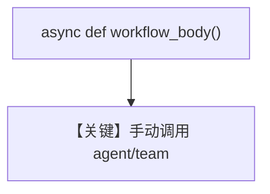

# function_workflow.py — 实现原理分析

<!-- cookbook-py-source:start -->
## 完整源码

```python
"""
Function Workflow
=================

Demonstrates using a single execution function in place of explicit step lists across sync and async run modes.
"""

import asyncio
from typing import AsyncIterator, Iterator

from agno.agent import Agent
from agno.db.sqlite import SqliteDb
from agno.models.openai import OpenAIChat
from agno.team import Team
from agno.tools.hackernews import HackerNewsTools
from agno.tools.websearch import WebSearchTools
from agno.workflow.types import WorkflowExecutionInput
from agno.workflow.workflow import Workflow

# ---------------------------------------------------------------------------
# Create Agents
# ---------------------------------------------------------------------------
hackernews_agent = Agent(
    name="Hackernews Agent",
    model=OpenAIChat(id="gpt-4o-mini"),
    tools=[HackerNewsTools()],
    role="Extract key insights and content from Hackernews posts",
)

web_agent = Agent(
    name="Web Agent",
    model=OpenAIChat(id="gpt-4o-mini"),
    tools=[WebSearchTools()],
    role="Search the web for the latest news and trends",
)

streaming_hackernews_agent = Agent(
    name="Hackernews Agent",
    model=OpenAIChat(id="gpt-5.2"),
    tools=[HackerNewsTools()],
    role="Research key insights and content from Hackernews posts",
)

content_planner = Agent(
    name="Content Planner",
    model=OpenAIChat(id="gpt-4o"),
    instructions=[
        "Plan a content schedule over 4 weeks for the provided topic and research content",
        "Ensure that I have posts for 3 posts per week",
    ],
)

# ---------------------------------------------------------------------------
# Create Team
# ---------------------------------------------------------------------------
research_team = Team(
    name="Research Team",
    members=[hackernews_agent, web_agent],
    instructions="Research tech topics from Hackernews and the web",
)


# ---------------------------------------------------------------------------
# Define Execution Functions
# ---------------------------------------------------------------------------
def custom_execution_function(
    workflow: Workflow,
    execution_input: WorkflowExecutionInput,
) -> str:
    print(f"Executing workflow: {workflow.name}")
    run_response = research_team.run(execution_input.input)
    research_content = run_response.content
    planning_prompt = f"""
        STRATEGIC CONTENT PLANNING REQUEST:

        Core Topic: {execution_input.input}

        Research Results: {research_content[:500]}

        Planning Requirements:
        1. Create a comprehensive content strategy based on the research
        2. Leverage the research findings effectively
        3. Identify content formats and channels
        4. Provide timeline and priority recommendations
        5. Include engagement and distribution strategies

        Please create a detailed, actionable content plan.
    """
    content_plan = content_planner.run(planning_prompt)
    return content_plan.content


def custom_execution_function_stream(
    workflow: Workflow,
    execution_input: WorkflowExecutionInput,
) -> Iterator:
    print(f"Executing workflow: {workflow.name}")
    research_content = ""
    for response in streaming_hackernews_agent.run(
        execution_input.input,
        stream=True,
        stream_events=True,
    ):
        if hasattr(response, "content") and response.content:
            research_content += str(response.content)

    planning_prompt = f"""
        STRATEGIC CONTENT PLANNING REQUEST:

        Core Topic: {execution_input.input}

        Research Results: {research_content[:500]}

        Planning Requirements:
        1. Create a comprehensive content strategy based on the research
        2. Leverage the research findings effectively
        3. Identify content formats and channels
        4. Provide timeline and priority recommendations
        5. Include engagement and distribution strategies

        Please create a detailed, actionable content plan.
    """
    yield from content_planner.run(
        planning_prompt,
        stream=True,
        stream_events=True,
    )


async def custom_execution_function_async(
    workflow: Workflow,
    execution_input: WorkflowExecutionInput,
) -> str:
    print(f"Executing workflow: {workflow.name}")
    run_response = research_team.run(execution_input.input)
    research_content = run_response.content
    planning_prompt = f"""
        STRATEGIC CONTENT PLANNING REQUEST:

        Core Topic: {execution_input.input}

        Research Results: {research_content[:500]}

        Planning Requirements:
        1. Create a comprehensive content strategy based on the research
        2. Leverage the research findings effectively
        3. Identify content formats and channels
        4. Provide timeline and priority recommendations
        5. Include engagement and distribution strategies

        Please create a detailed, actionable content plan.
    """
    content_plan = await content_planner.arun(planning_prompt)
    return content_plan.content


async def custom_execution_function_async_stream(
    workflow: Workflow,
    execution_input: WorkflowExecutionInput,
) -> AsyncIterator:
    print(f"Executing workflow: {workflow.name}")
    research_content = ""
    async for response in streaming_hackernews_agent.arun(
        execution_input.input,
        stream=True,
        stream_events=True,
    ):
        if hasattr(response, "content") and response.content:
            research_content += str(response.content)

    planning_prompt = f"""
        STRATEGIC CONTENT PLANNING REQUEST:

        Core Topic: {execution_input.input}

        Research Results: {research_content[:500]}

        Planning Requirements:
        1. Create a comprehensive content strategy based on the research
        2. Leverage the research findings effectively
        3. Identify content formats and channels
        4. Provide timeline and priority recommendations
        5. Include engagement and distribution strategies

        Please create a detailed, actionable content plan.
    """

    async for response in content_planner.arun(
        planning_prompt,
        stream=True,
        stream_events=True,
    ):
        yield response


# ---------------------------------------------------------------------------
# Create Workflows
# ---------------------------------------------------------------------------
sync_workflow = Workflow(
    name="Content Creation Workflow",
    description="Automated content creation from blog posts to social media",
    db=SqliteDb(
        session_table="workflow_session",
        db_file="tmp/workflow.db",
    ),
    steps=custom_execution_function,
)

sync_stream_workflow = Workflow(
    name="Content Creation Workflow",
    description="Automated content creation from blog posts to social media",
    db=SqliteDb(
        session_table="workflow_session",
        db_file="tmp/workflow.db",
    ),
    steps=custom_execution_function_stream,
)

async_workflow = Workflow(
    name="Content Creation Workflow",
    description="Automated content creation from blog posts to social media",
    db=SqliteDb(
        session_table="workflow_session",
        db_file="tmp/workflow.db",
    ),
    steps=custom_execution_function_async,
)

async_stream_workflow = Workflow(
    name="Content Creation Workflow",
    description="Automated content creation from blog posts to social media",
    db=SqliteDb(
        session_table="workflow_session",
        db_file="tmp/workflow.db",
    ),
    steps=custom_execution_function_async_stream,
)

# ---------------------------------------------------------------------------
# Run Workflow
# ---------------------------------------------------------------------------
if __name__ == "__main__":
    # Sync
    sync_workflow.print_response(
        input="AI trends in 2024",
    )

    # Sync Streaming
    sync_stream_workflow.print_response(
        input="AI trends in 2024",
        stream=True,
    )

    # Async
    asyncio.run(
        async_workflow.aprint_response(
            input="AI trends in 2024",
        )
    )

    # Async Streaming
    asyncio.run(
        async_stream_workflow.aprint_response(
            input="AI trends in 2024",
            stream=True,
        )
    )
```

<!-- cookbook-py-source:end -->

> 源文件：`cookbook/04_workflows/01_basic_workflows/03_function_workflows/function_workflow.py`

## 概述

本示例展示 **单函数驱动整段 Workflow 逻辑**（`Workflow(steps=...)` 的替代形态）：在 Python 函数内显式 `await agent.arun` / `team.arun`，而非声明式 `Steps` 列表。

## 运行机制与因果链

编排权在用户函数；框架仍提供 `Workflow.run` 的会话、metrics、db 生命周期。

## System Prompt 组装

各 `Agent`/`Team` 调用各自拼装 system；外层函数无统一 prompt。

## Mermaid 流程图


```mermaid
flowchart TD
    F["async def workflow_body()"] --> U["【关键】手动调用 agent/team"]
```

## 关键源码文件索引

| 文件 | 作用 |
|------|------|
| `agno/workflow/workflow.py` | 函数式 workflow 注册 |
