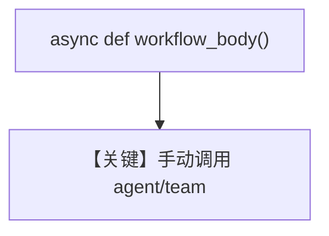

# function_workflow.py — 实现原理分析

> 源文件：`cookbook/04_workflows/01_basic_workflows/03_function_workflows/function_workflow.py`

## 概述

本示例展示 **单函数驱动整段 Workflow 逻辑**（`Workflow(steps=...)` 的替代形态）：在 Python 函数内显式 `await agent.arun` / `team.arun`，而非声明式 `Steps` 列表。

## 运行机制与因果链

编排权在用户函数；框架仍提供 `Workflow.run` 的会话、metrics、db 生命周期。

## System Prompt 组装

各 `Agent`/`Team` 调用各自拼装 system；外层函数无统一 prompt。

## Mermaid 流程图

```mermaid
flowchart TD
    F["async def workflow_body()"] --> U["【关键】手动调用 agent/team"]
```

## 关键源码文件索引

| 文件 | 作用 |
|------|------|
| `agno/workflow/workflow.py` | 函数式 workflow 注册 |
