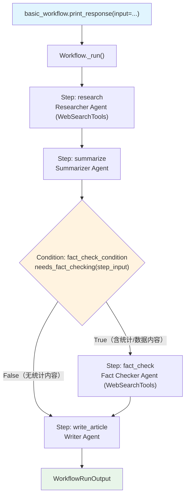

# condition_basic.py — 实现原理分析

> 源文件：`cookbook/04_workflows/02_conditional_execution/condition_basic.py`

## 概述

本示例展示 Agno Workflow 的 **`Condition 条件分支`** 机制：通过 `Condition(evaluator=fn, steps=[...])` 在工作流中插入条件门控，`evaluator` 返回 `True` 时执行 `steps` 块，`False` 时跳过，实现动态的内容感知路由。

**核心配置一览：**

| 配置项 | 值 | 说明 |
|--------|------|------|
| `Workflow.name` | `"Basic Linear Workflow"` | 线性条件工作流 |
| `Condition.name` | `"fact_check_condition"` | 条件块名称 |
| `Condition.evaluator` | `needs_fact_checking` | 布尔评估函数 |
| `Condition.steps` | `[fact_check_step]` | 条件为 True 时执行 |
| `else_steps` | 未设置（`None`）| 条件为 False 时跳过 |

## 架构分层

```
用户代码层                             agno.workflow 层
┌─────────────────────────────────┐  ┌────────────────────────────────────────────┐
│ condition_basic.py              │  │ Workflow._run()                            │
│                                  │  │  ├─ Step(research)._run()                 │
│ basic_workflow                  │  │  ├─ Step(summarize)._run()                 │
│   steps=[                       │──>│  ├─ Condition._run()                      │
│     research_step,              │  │  │   ├─ evaluator(step_input) → True/False │
│     summarize_step,             │  │  │   ├─ True → Step(fact_check)._run()     │
│     Condition(evaluator=fn,     │  │  │   └─ False → 跳过                      │
│       steps=[fact_check_step]), │  │  └─ Step(write_article)._run()            │
│     write_article,              │  └────────────────────────────────────────────┘
│   ]                             │
└─────────────────────────────────┘
```

## 核心组件解析

### Condition 评估器

```python
def needs_fact_checking(step_input: StepInput) -> bool:
    # 检查前一步骤（summarize）的内容
    summary = step_input.previous_step_content or ""
    fact_indicators = [
        "study shows", "research indicates", "statistics", "million", "percent", "%",
    ]
    return any(indicator in summary.lower() for indicator in fact_indicators)
```

评估器接收 `StepInput`，可通过以下方式做决策：
- `step_input.input` — 原始用户输入
- `step_input.previous_step_content` — 前一步骤输出（最常用）
- `step_input.previous_step_outputs` — 所有前置步骤输出

### Condition 工作流配置

```python
basic_workflow = Workflow(
    steps=[
        research_step,   # 始终执行
        summarize_step,  # 始终执行，结果作为 evaluator 输入
        Condition(
            name="fact_check_condition",
            description="Check if fact-checking is needed",
            evaluator=needs_fact_checking,   # 决策函数
            steps=[fact_check_step],         # True 时执行
            # else_steps 未设置 → False 时静默跳过
        ),
        write_article,   # 无论条件结果都执行
    ],
)
```

### Condition 执行逻辑

| evaluator 返回值 | 行为 |
|----------------|------|
| `True` | 执行 `steps` 列表（可包含多个步骤） |
| `False` | 跳过整个 Condition 块，继续后续步骤 |
| `False` + `else_steps` 已设置 | 执行 `else_steps` |

## 执行路径

**包含数据性内容时（evaluator = True）：**
```
research → summarize → fact_check → write_article
```

**不含数据性内容时（evaluator = False）：**
```
research → summarize → (跳过) → write_article
```

## Mermaid 流程图



## 关键源码文件索引

| 文件 | 关键类/函数 | 作用 |
|------|------------|------|
| `agno/workflow/condition.py` | `Condition` L42 | 条件分支执行容器 |
| `agno/workflow/condition.py` | `Condition.evaluator` L79 | 布尔评估函数/CEL/bool |
| `agno/workflow/types.py` | `StepInput.previous_step_content` L104 | evaluator 常用输入 |
