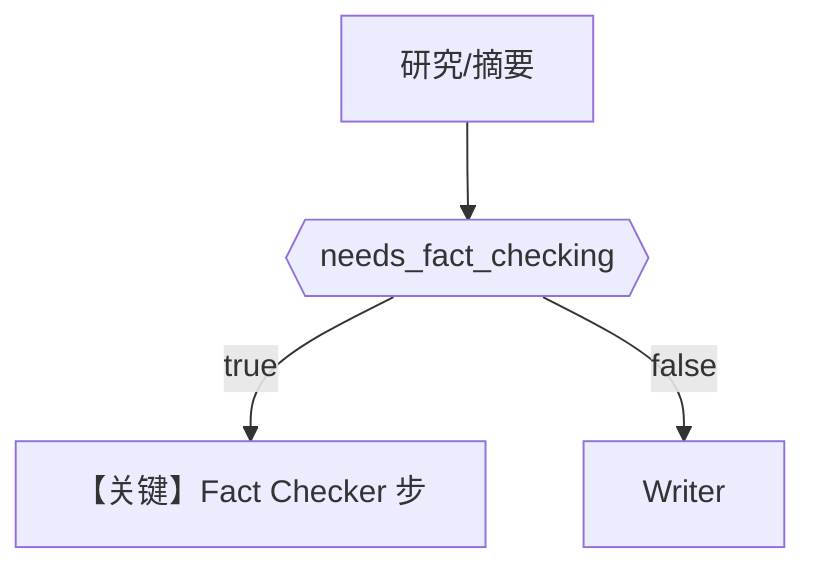

# condition_basic.py — 实现原理分析

> 源文件：`cookbook/04_workflows/02_conditional_execution/condition_basic.py`

## 概述

本示例展示 **`Condition` 步骤**：根据 `StepInput`（如上一摘要是否含「需事实核查」关键词）决定是否执行 **Fact Checker** 分支，实现线性工作流中的 **事实核查门控**。

## 运行机制与因果链

评估函数 `needs_fact_checking` 返回 bool → `Condition` 选择子步骤列表 → 继续主流程。

## System Prompt 组装

条件本身不调用 LLM；内部 Agent 仍各自 `get_system_message`。

## Mermaid 流程图

```mermaid
flowchart TD
    R["研究/摘要"] --> D{{needs_fact_checking}}
    D -->|true| F["【关键】Fact Checker 步"]
    D -->|false| W["Writer"]
```

## 关键源码文件索引

| 文件 | 作用 |
|------|------|
| `agno/workflow/condition.py` | `Condition` |
