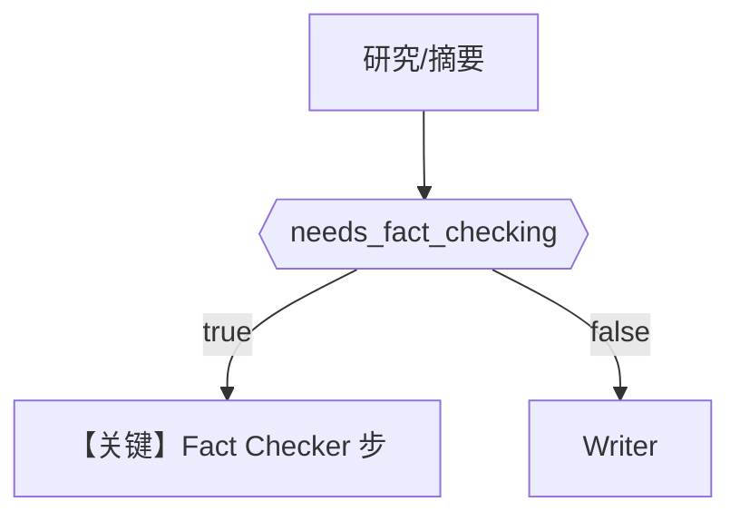

# condition_basic.py — 实现原理分析

<!-- cookbook-py-source:start -->
## 完整源码

```python
"""
Condition Basic
===============

Demonstrates conditional step execution using a fact-check gate in a linear workflow.
"""

import asyncio

from agno.agent.agent import Agent
from agno.tools.websearch import WebSearchTools
from agno.workflow.condition import Condition
from agno.workflow.step import Step
from agno.workflow.types import StepInput
from agno.workflow.workflow import Workflow

# ---------------------------------------------------------------------------
# Create Agents
# ---------------------------------------------------------------------------
researcher = Agent(
    name="Researcher",
    instructions="Research the given topic and provide detailed findings.",
    tools=[WebSearchTools()],
)

summarizer = Agent(
    name="Summarizer",
    instructions="Create a clear summary of the research findings.",
)

fact_checker = Agent(
    name="Fact Checker",
    instructions="Verify facts and check for accuracy in the research.",
    tools=[WebSearchTools()],
)

writer = Agent(
    name="Writer",
    instructions="Write a comprehensive article based on all available research and verification.",
)


# ---------------------------------------------------------------------------
# Define Condition Evaluator
# ---------------------------------------------------------------------------
def needs_fact_checking(step_input: StepInput) -> bool:
    summary = step_input.previous_step_content or ""
    fact_indicators = [
        "study shows",
        "research indicates",
        "according to",
        "statistics",
        "data shows",
        "survey",
        "report",
        "million",
        "billion",
        "percent",
        "%",
        "increase",
        "decrease",
    ]
    return any(indicator in summary.lower() for indicator in fact_indicators)


# ---------------------------------------------------------------------------
# Define Steps
# ---------------------------------------------------------------------------
research_step = Step(
    name="research",
    description="Research the topic",
    agent=researcher,
)

summarize_step = Step(
    name="summarize",
    description="Summarize research findings",
    agent=summarizer,
)

fact_check_step = Step(
    name="fact_check",
    description="Verify facts and claims",
    agent=fact_checker,
)

write_article = Step(
    name="write_article",
    description="Write final article",
    agent=writer,
)

# ---------------------------------------------------------------------------
# Create Workflow
# ---------------------------------------------------------------------------
basic_workflow = Workflow(
    name="Basic Linear Workflow",
    description="Research -> Summarize -> Condition(Fact Check) -> Write Article",
    steps=[
        research_step,
        summarize_step,
        Condition(
            name="fact_check_condition",
            description="Check if fact-checking is needed",
            evaluator=needs_fact_checking,
            steps=[fact_check_step],
        ),
        write_article,
    ],
)

# ---------------------------------------------------------------------------
# Run Workflow
# ---------------------------------------------------------------------------
if __name__ == "__main__":
    print("Running Basic Linear Workflow Example")
    print("=" * 50)

    try:
        # Sync Streaming
        basic_workflow.print_response(
            input="Recent breakthroughs in quantum computing",
            stream=True,
        )

        # Async Streaming
        asyncio.run(
            basic_workflow.aprint_response(
                input="Recent breakthroughs in quantum computing",
                stream=True,
            )
        )
    except Exception as e:
        print(f"[ERROR] {e}")
        import traceback

        traceback.print_exc()
```

<!-- cookbook-py-source:end -->

> 源文件：`cookbook/04_workflows/02_conditional_execution/condition_basic.py`

## 概述

本示例展示 **`Condition` 步骤**：根据 `StepInput`（如上一摘要是否含「需事实核查」关键词）决定是否执行 **Fact Checker** 分支，实现线性工作流中的 **事实核查门控**。

## 运行机制与因果链

评估函数 `needs_fact_checking` 返回 bool → `Condition` 选择子步骤列表 → 继续主流程。

## System Prompt 组装

条件本身不调用 LLM；内部 Agent 仍各自 `get_system_message`。

## Mermaid 流程图


```mermaid
flowchart TD
    R["研究/摘要"] --> D{{needs_fact_checking}}
    D -->|true| F["【关键】Fact Checker 步"]
    D -->|false| W["Writer"]
```

## 关键源码文件索引

| 文件 | 作用 |
|------|------|
| `agno/workflow/condition.py` | `Condition` |
