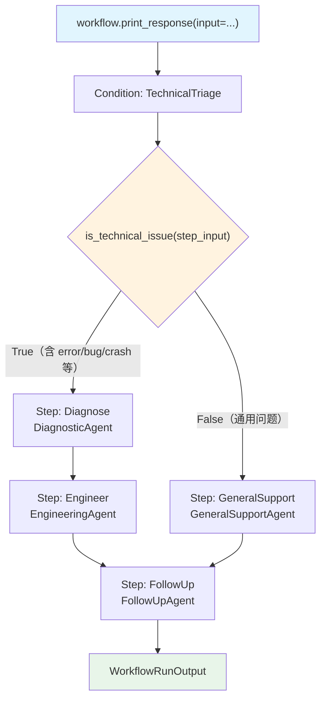

# condition_with_else.py — 实现原理分析

> 源文件：`cookbook/04_workflows/02_conditional_execution/condition_with_else.py`

## 概述

本示例展示 Agno Workflow 的 **`Condition else_steps 双分支路由`** 机制：通过 `Condition(steps=[...], else_steps=[...])` 实现真正的 if-else 路由，`evaluator` 为 `True` 执行 `steps`（技术支持流），`False` 执行 `else_steps`（通用支持流），两者最终汇聚到公共步骤。

**核心配置一览：**

| 配置项 | 值 | 说明 |
|--------|------|------|
| `Condition.evaluator` | `is_technical_issue` | 关键词检测 |
| `Condition.steps` | `[diagnose_step, engineer_step]` | 技术支持路径（True） |
| `Condition.else_steps` | `[general_step]` | 通用支持路径（False） |
| 公共步骤 | `followup_step` | 无论分支都执行 |

## 架构分层

```
用户代码层                              agno.workflow 层
┌──────────────────────────────────┐  ┌────────────────────────────────────────────┐
│ condition_with_else.py          │  │ Workflow._run()                            │
│                                  │  │  └─ Condition._run()                      │
│ workflow                         │──>│      ├─ evaluator(step_input) → True/False│
│   steps=[                        │  │      ├─ True → [diagnose, engineer]        │
│     Condition(                   │  │      └─ False → [general_step]            │
│       evaluator=is_technical,    │  │  └─ Step(followup)._run()                 │
│       steps=[diagnose, engineer],│  └────────────────────────────────────────────┘
│       else_steps=[general],      │
│     ),                           │
│     followup_step,               │
│   ]                              │
└──────────────────────────────────┘
```

## 核心组件解析

### 评估器（关键词检测）

```python
def is_technical_issue(step_input: StepInput) -> bool:
    text = (step_input.input or "").lower()
    tech_keywords = ["error", "bug", "crash", "not working", "api", "timeout", "logs"]
    return any(kw in text for kw in tech_keywords)
```

### 双分支 Condition 配置

```python
Condition(
    name="TechnicalTriage",
    description="Route to technical or general support",
    evaluator=is_technical_issue,
    steps=[diagnose_step, engineer_step],  # True 路径：诊断 + 工程支持
    else_steps=[general_step],             # False 路径：通用客服
)
```

### 两个 Workflow 变体

```python
# workflow 包含 description
workflow = Workflow(
    name="Customer Support Router",
    description="Routes customer queries through technical or general support",
    steps=[Condition(...), followup_step],
)

# workflow_2 简化版（无 description）
workflow_2 = Workflow(
    name="Customer Support Router",
    steps=[Condition(...), followup_step],
)
```

## 执行路径对比

| 输入类型 | evaluator | 执行路径 |
|---------|-----------|---------|
| `"app keeps crashing with timeout error"` | `True` | diagnose → engineer → followup |
| `"How do I change my shipping address?"` | `False` | general_support → followup |

## Mermaid 流程图



## 关键源码文件索引

| 文件 | 关键类/函数 | 作用 |
|------|------------|------|
| `agno/workflow/condition.py` | `Condition.else_steps` L85 | else 分支步骤列表 |
| `agno/workflow/condition.py` | `Condition._run()` | 分支路由逻辑 |
