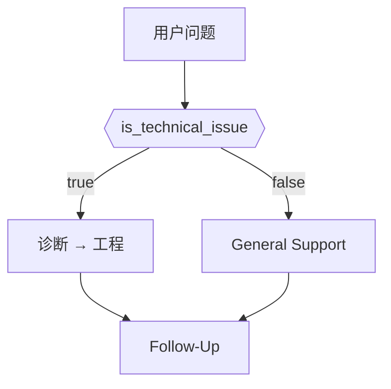

# condition_with_else.py — 实现原理分析

> 源文件：`cookbook/04_workflows/02_conditional_execution/condition_with_else.py`

## 概述

本示例展示 **`Condition(..., else_steps=[...])`**：判断 **技术问题 vs 非技术**，分别路由到 **诊断+工程** 分支或 **通用客服** 分支，最后进入 **Follow-Up**。

## 运行机制与因果链

`is_technical_issue(step_input)` 解析用户首条或当前输入；`else_steps` 捕获「非技术」路径。

## Mermaid 流程图

```mermaid
flowchart TD
    Q["用户问题"] --> C{{is_technical_issue}}
    C -->|true| Tech["诊断 → 工程"]
    C -->|false| Gen["General Support"]
    Tech --> F["Follow-Up"]
    Gen --> F
```

## 关键源码文件索引

| 文件 | 作用 |
|------|------|
| `agno/workflow/condition.py` | `else_steps` |
