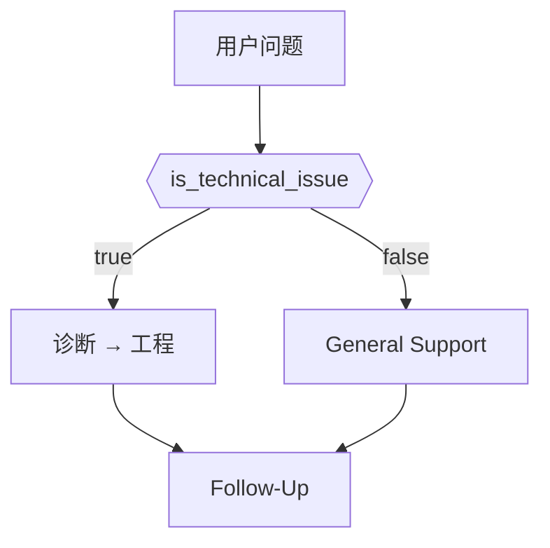

# condition_with_else.py — 实现原理分析

<!-- cookbook-py-source:start -->
## 完整源码

```python
"""
Condition With Else
===================

Demonstrates `Condition(..., else_steps=[...])` for routing between technical and general support branches.
"""

import asyncio

from agno.agent.agent import Agent
from agno.workflow.condition import Condition
from agno.workflow.step import Step
from agno.workflow.types import StepInput
from agno.workflow.workflow import Workflow

# ---------------------------------------------------------------------------
# Create Agents
# ---------------------------------------------------------------------------
diagnostic_agent = Agent(
    name="Diagnostic Agent",
    instructions=(
        "You are a diagnostic specialist. Analyze the technical issue described "
        "by the customer and list the most likely root causes. Be concise."
    ),
)

engineering_agent = Agent(
    name="Engineering Agent",
    instructions=(
        "You are a senior engineer. Given the diagnostic analysis, provide "
        "step-by-step troubleshooting instructions the customer can follow."
    ),
)

general_support_agent = Agent(
    name="General Support Agent",
    instructions=(
        "You are a friendly customer support agent. Help the customer with "
        "their non-technical question — billing, account, shipping, returns, etc."
    ),
)

followup_agent = Agent(
    name="Follow-Up Agent",
    instructions=(
        "You are a follow-up specialist. Summarize what was resolved so far "
        "and ask the customer if they need anything else."
    ),
)


# ---------------------------------------------------------------------------
# Define Condition Evaluator
# ---------------------------------------------------------------------------
def is_technical_issue(step_input: StepInput) -> bool:
    text = (step_input.input or "").lower()
    tech_keywords = [
        "error",
        "bug",
        "crash",
        "not working",
        "broken",
        "install",
        "update",
        "password reset",
        "api",
        "timeout",
        "exception",
        "failed",
        "logs",
        "debug",
    ]
    return any(kw in text for kw in tech_keywords)


# ---------------------------------------------------------------------------
# Define Steps
# ---------------------------------------------------------------------------
diagnose_step = Step(
    name="Diagnose",
    description="Run diagnostics on the technical issue",
    agent=diagnostic_agent,
)

engineer_step = Step(
    name="Engineer",
    description="Provide engineering-level troubleshooting",
    agent=engineering_agent,
)

general_step = Step(
    name="GeneralSupport",
    description="Handle non-technical customer queries",
    agent=general_support_agent,
)

followup_step = Step(
    name="FollowUp",
    description="Wrap up with a follow-up message",
    agent=followup_agent,
)

# ---------------------------------------------------------------------------
# Create Workflow
# ---------------------------------------------------------------------------
workflow = Workflow(
    name="Customer Support Router",
    description="Routes customer queries through technical or general support pipelines",
    steps=[
        Condition(
            name="TechnicalTriage",
            description="Route to technical or general support based on query content",
            evaluator=is_technical_issue,
            steps=[diagnose_step, engineer_step],
            else_steps=[general_step],
        ),
        followup_step,
    ],
)

workflow_2 = Workflow(
    name="Customer Support Router",
    steps=[
        Condition(
            name="TechnicalTriage",
            evaluator=is_technical_issue,
            steps=[diagnose_step, engineer_step],
            else_steps=[general_step],
        ),
        followup_step,
    ],
)

# ---------------------------------------------------------------------------
# Run Workflow
# ---------------------------------------------------------------------------
if __name__ == "__main__":
    print("=" * 60)
    print("Test 1: Technical query (expects if-branch)")
    print("=" * 60)
    workflow.print_response(
        "My app keeps crashing with a timeout error after the latest update"
    )

    print()
    print("=" * 60)
    print("Test 2: General query (expects else-branch)")
    print("=" * 60)
    workflow_2.print_response("How do I change my shipping address for order #12345?")

    print()
    print("=" * 60)
    print("Async Technical Query")
    print("=" * 60)
    asyncio.run(
        workflow.aprint_response(
            "My app keeps crashing with a timeout error after the latest update"
        )
    )

    print()
    print("=" * 60)
    print("Async General Query")
    print("=" * 60)
    asyncio.run(
        workflow_2.aprint_response(
            "How do I change my shipping address for order #12345?"
        )
    )
```

<!-- cookbook-py-source:end -->

> 源文件：`cookbook/04_workflows/02_conditional_execution/condition_with_else.py`

## 概述

本示例展示 **`Condition(..., else_steps=[...])`**：判断 **技术问题 vs 非技术**，分别路由到 **诊断+工程** 分支或 **通用客服** 分支，最后进入 **Follow-Up**。

## 运行机制与因果链

`is_technical_issue(step_input)` 解析用户首条或当前输入；`else_steps` 捕获「非技术」路径。

## Mermaid 流程图


```mermaid
flowchart TD
    Q["用户问题"] --> C{{is_technical_issue}}
    C -->|true| Tech["诊断 → 工程"]
    C -->|false| Gen["General Support"]
    Tech --> F["Follow-Up"]
    Gen --> F
```

## 关键源码文件索引

| 文件 | 作用 |
|------|------|
| `agno/workflow/condition.py` | `else_steps` |
