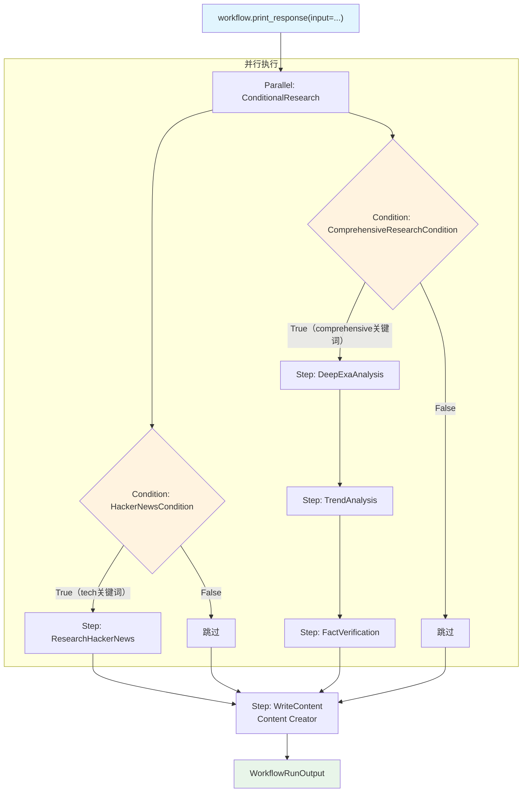

# condition_with_list.py — 实现原理分析

> 源文件：`cookbook/04_workflows/02_conditional_execution/condition_with_list.py`

## 概述

本示例展示 Agno Workflow 的 **`Condition 多步骤条件块 + Parallel 内嵌 Condition`** 机制：`Condition.steps` 可包含多个步骤（含 Parallel），两个 Condition 被嵌套在 `Parallel` 内并发执行，展示条件与并行的组合使用。

**核心配置一览：**

| 配置项 | 值 | 说明 |
|--------|------|------|
| `Parallel` 包含内容 | `[Condition(HN), Condition(Comprehensive)]` | 两个条件块并行 |
| Condition 1 | `HackerNewsCondition` → `[research_hn]` | 技术主题路径 |
| Condition 2 | `ComprehensiveResearch` → `[deep_exa, trend, fact]` | 综合研究路径 |
| 最终步骤 | `write_step` | 始终执行 |

## 架构分层

```
用户代码层                              agno.workflow 层
┌──────────────────────────────────┐  ┌────────────────────────────────────────────┐
│ condition_with_list.py          │  │ Workflow._run()                            │
│                                  │  │  ├─ Parallel._run()（并行）               │
│ workflow                         │──>│  │   ├─ Condition(HN)._run()             │
│   steps=[                        │  │  │   │   ├─ evaluator → T/F              │
│     Parallel(                    │  │  │   │   └─ True → research_hn           │
│       Condition(HN, [hn]),       │  │  │   └─ Condition(Comp)._run()           │
│       Condition(Comp, [exa,trend,│  │  │       ├─ evaluator → T/F              │
│                fact]),           │  │  │       └─ True → [deep_exa,trend,fact] │
│     ),                           │  │  └─ Step(write)._run()                   │
│     write_step,                  │  └────────────────────────────────────────────┘
│   ]                              │
└──────────────────────────────────┘
```

## 核心组件解析

### 多步骤 Condition（Comprehensive Research）

```python
Condition(
    name="ComprehensiveResearchCondition",
    evaluator=check_if_comprehensive_research_needed,
    steps=[
        deep_exa_analysis_step,   # 步骤 1
        trend_analysis_step,       # 步骤 2（串行）
        fact_verification_step,    # 步骤 3（串行）
    ],
)
```

当 `evaluator` 为 True 时，三个步骤**串行**执行。

### Parallel 内嵌 Condition

```python
Parallel(
    Condition(
        name="HackerNewsCondition",
        evaluator=check_if_we_should_search_hn,
        steps=[research_hackernews_step],
    ),
    Condition(
        name="ComprehensiveResearchCondition",
        evaluator=check_if_comprehensive_research_needed,
        steps=[deep_exa_analysis_step, trend_analysis_step, fact_verification_step],
    ),
    name="ConditionalResearch",
)
```

两个 Condition 块**并行**触发，各自独立评估，各自执行或跳过。

### 两个评估器

```python
def check_if_we_should_search_hn(step_input: StepInput) -> bool:
    topic = step_input.input or ""
    return any(k in topic.lower() for k in ["ai", "tech", "startup", "coding"])

def check_if_comprehensive_research_needed(step_input: StepInput) -> bool:
    topic = step_input.input or ""
    return any(k in topic.lower() for k in ["comprehensive", "detailed", "thorough"])
```

## 执行矩阵

| 输入内容 | HN Condition | Comp Condition | 实际执行步骤 |
|---------|-------------|----------------|------------|
| "AI tech startup" | True | False | research_hn |
| "comprehensive climate analysis" | False | True | deep_exa + trend + fact |
| "comprehensive AI research" | True | True | research_hn \|\| (deep_exa + trend + fact) 并行 |
| "generic topic" | False | False | 仅 write_step |

## Mermaid 流程图



## 关键源码文件索引

| 文件 | 关键类/函数 | 作用 |
|------|------------|------|
| `agno/workflow/condition.py` | `Condition.steps` L77 | 可包含多个串行步骤 |
| `agno/workflow/parallel.py` | `Parallel` L43 | 并行执行多个步骤/条件 |
