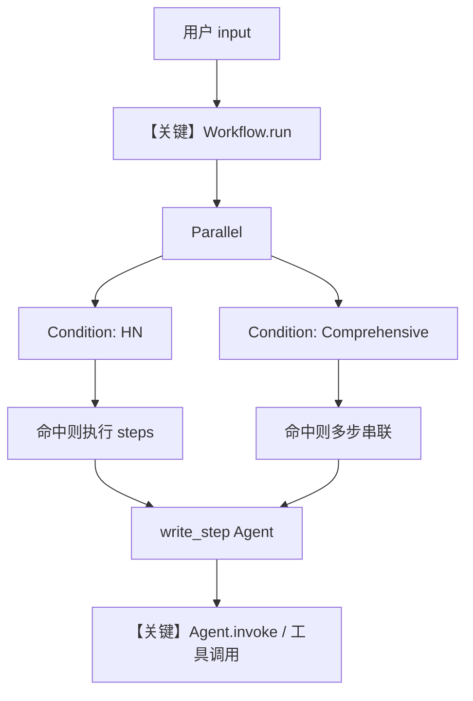

# condition_with_list.py — 实现原理分析

<!-- cookbook-py-source:start -->
## 完整源码

```python
"""
Condition With List
===================

Demonstrates condition branches that execute a list of multiple steps, including parallel conditional blocks.
"""

import asyncio

from agno.agent.agent import Agent
from agno.tools.exa import ExaTools
from agno.tools.hackernews import HackerNewsTools
from agno.workflow.condition import Condition
from agno.workflow.parallel import Parallel
from agno.workflow.step import Step
from agno.workflow.types import StepInput
from agno.workflow.workflow import Workflow

# ---------------------------------------------------------------------------
# Create Agents
# ---------------------------------------------------------------------------
hackernews_agent = Agent(
    name="HackerNews Researcher",
    instructions="Research tech news and trends from Hacker News",
    tools=[HackerNewsTools()],
)

exa_agent = Agent(
    name="Exa Search Researcher",
    instructions="Research using Exa advanced search capabilities",
    tools=[ExaTools()],
)

content_agent = Agent(
    name="Content Creator",
    instructions="Create well-structured content from research data",
)

trend_analyzer_agent = Agent(
    name="Trend Analyzer",
    instructions="Analyze trends and patterns from research data",
)

fact_checker_agent = Agent(
    name="Fact Checker",
    instructions="Verify facts and cross-reference information",
)

# ---------------------------------------------------------------------------
# Define Steps
# ---------------------------------------------------------------------------
research_hackernews_step = Step(
    name="ResearchHackerNews",
    description="Research tech news from Hacker News",
    agent=hackernews_agent,
)

research_exa_step = Step(
    name="ResearchExa",
    description="Research using Exa search",
    agent=exa_agent,
)

deep_exa_analysis_step = Step(
    name="DeepExaAnalysis",
    description="Conduct deep analysis using Exa search capabilities",
    agent=exa_agent,
)

trend_analysis_step = Step(
    name="TrendAnalysis",
    description="Analyze trends and patterns from the research data",
    agent=trend_analyzer_agent,
)

fact_verification_step = Step(
    name="FactVerification",
    description="Verify facts and cross-reference information",
    agent=fact_checker_agent,
)

write_step = Step(
    name="WriteContent",
    description="Write the final content based on research",
    agent=content_agent,
)


# ---------------------------------------------------------------------------
# Define Condition Evaluators
# ---------------------------------------------------------------------------
def check_if_we_should_search_hn(step_input: StepInput) -> bool:
    topic = step_input.input or step_input.previous_step_content or ""
    tech_keywords = [
        "ai",
        "machine learning",
        "programming",
        "software",
        "tech",
        "startup",
        "coding",
    ]
    return any(keyword in topic.lower() for keyword in tech_keywords)


def check_if_comprehensive_research_needed(step_input: StepInput) -> bool:
    topic = step_input.input or step_input.previous_step_content or ""
    comprehensive_keywords = [
        "comprehensive",
        "detailed",
        "thorough",
        "in-depth",
        "complete analysis",
        "full report",
        "extensive research",
    ]
    return any(keyword in topic.lower() for keyword in comprehensive_keywords)


# ---------------------------------------------------------------------------
# Create Workflow
# ---------------------------------------------------------------------------
workflow = Workflow(
    name="Conditional Workflow with Multi-Step Condition",
    steps=[
        Parallel(
            Condition(
                name="HackerNewsCondition",
                description="Check if we should search Hacker News for tech topics",
                evaluator=check_if_we_should_search_hn,
                steps=[research_hackernews_step],
            ),
            Condition(
                name="ComprehensiveResearchCondition",
                description="Check if comprehensive multi-step research is needed",
                evaluator=check_if_comprehensive_research_needed,
                steps=[
                    deep_exa_analysis_step,
                    trend_analysis_step,
                    fact_verification_step,
                ],
            ),
            name="ConditionalResearch",
            description="Run conditional research steps in parallel",
        ),
        write_step,
    ],
)

# ---------------------------------------------------------------------------
# Run Workflow
# ---------------------------------------------------------------------------
if __name__ == "__main__":
    try:
        # Sync Streaming
        workflow.print_response(
            input="Comprehensive analysis of climate change research",
            stream=True,
        )

        # Async
        asyncio.run(
            workflow.aprint_response(
                input="Comprehensive analysis of climate change research",
            )
        )
    except Exception as e:
        print(f"[ERROR] {e}")
    print()
```

<!-- cookbook-py-source:end -->

> 源文件：`cookbook/04_workflows/02_conditional_execution/condition_with_list.py`

## 概述

本示例展示 Agno 的 **Condition 多步分支 + Parallel 并行条件块** 机制：在并行组内用多个 `Condition` 按 `evaluator` 布尔结果决定是否执行对应 `steps` 列表（可为多步）；未命中分支则跳过；最后经 `write_step` 汇总输出。

**核心配置一览：**

| 配置项 | 值 | 说明 |
|--------|------|------|
| `Workflow.name` | `"Conditional Workflow with Multi-Step Condition"` | 工作流名称 |
| `Workflow.steps` | `Parallel(...), write_step` | 并行条件研究 + 写作 |
| `Workflow.description` | `None` | 未设置 |
| `Workflow.db` | `None` | 未设置 |
| `Parallel` 内含 | 两个 `Condition` | HN 条件单步；综合研究条件三步串联 |
| 各 `Agent` | 见源码 | 未显式 `model`，走框架默认 Chat 模型 |

## 架构分层

```
用户代码层                agno.workflow 层
┌──────────────────┐    ┌──────────────────────────────────┐
│ condition_       │    │ Workflow.run() / arun()            │
│ with_list.py     │───>│  ├ 调度 Parallel → Condition       │
│ input 字符串     │    │  │   evaluator(StepInput) → bool   │
│                  │    │  │   为 True 则执行 steps 列表      │
│                  │    │  └ Step(agent=...) → Agent 子调用  │
└──────────────────┘    └──────────────────────────────────┘
                                │
                                ▼
                        ┌──────────────┐
                        │ 各 Agent 对应│
                        │ Model 默认   │
                        └──────────────┘
```

## 核心组件解析

### Condition 与 StepInput

`Condition` 定义见 `agno/workflow/condition.py`：`evaluator` 可为可调用、`bool` 或 CEL 字符串；为 `True` 时执行 `steps`（`L41-L87` 附近 dataclass 字段）。

本文件中的 `check_if_we_should_search_hn`、`check_if_comprehensive_research_needed` 从 `step_input.input` 或 `step_input.previous_step_content` 取主题并做关键词匹配（`L92-L117`）。

### Parallel 包裹多个 Condition

`Parallel`（`agno/workflow/parallel.py` `L42-L85`）将多个子步骤并行执行；此处每个子项是 `Condition`，各自独立判定与执行。

### Workflow 入口

`Workflow.run()`（`agno/workflow/workflow.py` `L6411` 起）负责会话、`register_run`、逐步执行；`print_response` 调用 `workflow.run()`（`agno/utils/print_response/workflow.py` `L126`）。

### 运行机制与因果链

1. **数据路径**：用户字符串 → `WorkflowExecutionInput` → 第一顶层步为 `Parallel` → 各 `Condition` 的 `evaluator(StepInput)` → 若为真则顺序执行该 `Condition` 的 `steps` 列表 → 并行块结束后进入 `write_step`，写作 Agent 收到上游合并上下文。
2. **状态与副作用**：未配置 `db` 时仍可能内存/会话对象；工具调用（HackerNews、Exa）产生外部 API 副作用；重试 run 会重复可能的外部请求。
3. **关键分支**：`evaluator` 为 `False` 时该 `Condition` 的 `steps` 不执行；`Parallel` 内各 `Condition` 互不阻塞结论于同一轮输入。
4. **与相邻示例差异**：相对 `condition_with_parallel.py`，本例突出 **单个 Condition 的 `steps` 为多步列表**（深度分析→趋势→事实核对）。

## System Prompt 组装

本示例**不存在**单一顶层 `Agent` 的 `get_system_message()` 覆盖整条工作流；提示词分布在各 `Step` 绑定的 `Agent` 上。以下按子 Agent **字面量 instructions** 还原（来自源文件 `L22-L47`）。

| 序号 | 组成部分 | 本文件中的值/来源 | 是否生效 |
|------|---------|-----------------|---------|
| 1 | HackerNews Agent `instructions` | `"Research tech news and trends from Hacker News"` | 是（执行该 Step 时） |
| 2 | Exa Agent `instructions` | `"Research using Exa advanced search capabilities"` | 是 |
| 3 | Content Agent `instructions` | `"Create well-structured content from research data"` | 是 |
| 4 | Trend Analyzer `instructions` | `"Analyze trends and patterns from research data"` | 是 |
| 5 | Fact Checker `instructions` | `"Verify facts and cross-reference information"` | 是 |
| — | Workflow 级 system | 无 | 否 |

### 拼装顺序与源码锚点

子 Agent 运行时仍走 `get_system_message()`（`agno/agent/_messages.py`）默认拼装；本 cookbook 未传入 `system_message` 或 `build_context=False`。

### 还原后的完整 System 文本（以 HackerNews Researcher 为例）

```text
Research tech news and trends from Hacker News
```

（其余 Agent 同上表逐字 instructions；若默认模型另注入 datetime 等，需运行时断点 `get_system_message` 验证。）

### 段落释义（模型视角）

- 研究类 Agent：限定信息源与任务（HN / Exa / 趋势 / 事实）。
- 写作 Agent：将上游材料整理成终稿。
- 条件步不修改 system，只决定是否调用哪条 Agent 链。

### 与 User 消息的边界

工作流 `input` 作为用户侧需求传入各 `StepInput`；具体进入 Agent 的 user 消息由工作流执行器在调用 `Agent.run` 时注入，与上述 system instructions 叠加。

## 完整 API 请求

```python
# 典型：某 Step 内 Agent 使用 OpenAI Chat Completions 系适配器时等价于：

# messages ≈ [
#   {"role": "system", "content": <get_system_message 拼装结果>},
#   {"role": "user", "content": <工作流传入的主题/上文>},
# ]
# chat.completions.create(model=<默认 id>, messages=messages, tools=<HackerNewsTools/ExaTools  schema>)

# 精确模型 id 与是否 Responses API 取决于环境变量与 agno.models 默认；本文件未写死 model。
```

> 与第 5 节一致：system 正文为各 Agent `instructions` 加框架默认段；user 为当次 run 输入或前序内容。

## Mermaid 流程图


```mermaid
flowchart TD
    A["用户 input"] --> B["【关键】Workflow.run"]
    B --> C["Parallel"]
    C --> D1["Condition: HN"]
    C --> D2["Condition: Comprehensive"]
    D1 --> E1["命中则执行 steps"]
    D2 --> E2["命中则多步串联"]
    E1 --> F["write_step Agent"]
    E2 --> F
    F --> G["【关键】Agent.invoke / 工具调用"]
```

- **【关键】Workflow.run**：编排与会话入口（`workflow.py` `L6411`）。
- **【关键】Agent.invoke**：实际 LLM + 工具请求发生在 Step 内 Agent。

## 关键源码文件索引

| 文件 | 关键函数/类 | 作用 |
|------|------------|------|
| `agno/workflow/workflow.py` | `Workflow` L208；`run()` L6411 | 工作流执行 |
| `agno/workflow/condition.py` | `Condition` L41 | 条件分支 |
| `agno/workflow/parallel.py` | `Parallel` L42 | 并行块 |
| `agno/utils/print_response/workflow.py` | `print_response()` L44 | 控制台输出并调用 `run` |
| `agno/agent/_messages.py` | `get_system_message()` | 子 Agent system 拼装 |
