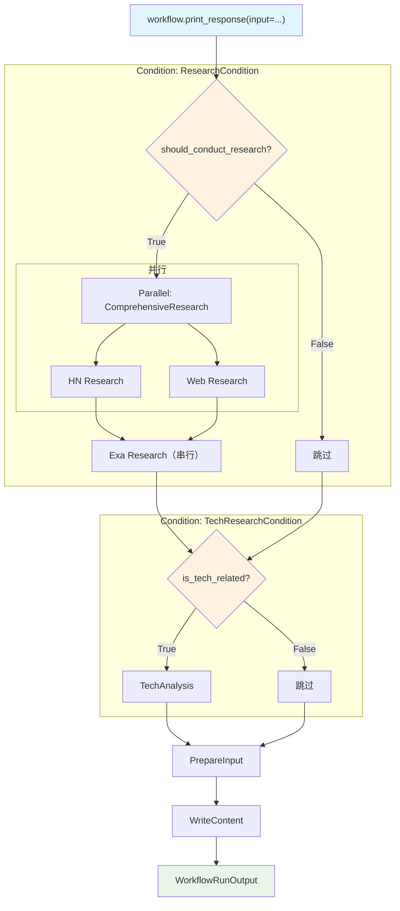

# condition_with_parallel.py — 实现原理分析

> 源文件：`cookbook/04_workflows/02_conditional_execution/condition_with_parallel.py`

## 概述

本示例展示 Agno Workflow 的 **`Condition 内嵌 Parallel（条件触发并行研究）`** 机制：Condition 的 `steps` 中包含 `Parallel`，当条件为 True 时，同时启动多个研究 Agent 并行工作，然后继续串行步骤，形成「条件 → 并行 → 串行」的复合结构。

**核心配置一览：**

| 配置项 | 值 | 说明 |
|--------|------|------|
| `Condition 1.steps` | `[Parallel(hn, web), research_exa]` | 条件内嵌并行 + 串行 |
| `Condition 2.steps` | `[tech_analysis_step]` | 单步条件 |
| 公共步骤 | `prepare_input + write_step` | 始终执行 |

## 架构分层

```
Workflow._run()
  ├─ Condition(ResearchCondition)
  │   ├─ evaluator → should_conduct_research
  │   └─ True:
  │       ├─ Parallel(HN Research, Web Research)  ← 并行
  │       └─ Step(Exa Research)                   ← 串行继续
  ├─ Condition(TechResearchCondition)
  │   └─ True: Step(TechAnalysis)
  ├─ Step(PrepareInput)
  └─ Step(WriteContent)
```

## 核心组件解析

### Condition 内嵌 Parallel

```python
Condition(
    name="ResearchCondition",
    evaluator=should_conduct_research,
    steps=[
        Parallel(
            research_hackernews_step,  # 并行步骤 1
            research_web_step,         # 并行步骤 2
            name="ComprehensiveResearch",
        ),
        research_exa_step,             # 并行完成后串行执行
    ],
)
```

### 多层条件组合

```python
workflow = Workflow(
    steps=[
        Condition(        # 条件 1：是否需要研究
            name="ResearchCondition",
            evaluator=should_conduct_research,
            steps=[Parallel(hn, web), exa],
        ),
        Condition(        # 条件 2：是否需要技术分析
            name="TechResearchCondition",
            evaluator=is_tech_related,
            steps=[tech_analysis_step],
        ),
        prepare_input_for_write_step,  # 始终执行
        write_step,                    # 始终执行
    ],
)
```

## 执行矩阵

| 输入内容 | Condition 1 | Condition 2 | 执行步骤 |
|---------|------------|------------|---------|
| "AI developments" | True | True | Parallel(hn,web) + exa + tech + prepare + write |
| "climate change facts" | True | False | Parallel(hn,web) + exa + prepare + write |
| "recipe ideas" | False | False | prepare + write |

## Mermaid 流程图



## 关键源码文件索引

| 文件 | 关键类/函数 | 作用 |
|------|------------|------|
| `agno/workflow/condition.py` | `Condition` L42 | 条件分支，steps 可嵌套 Parallel |
| `agno/workflow/parallel.py` | `Parallel` L43 | 并行执行（线程池） |
